# Tema 2 - Adquisición, formación y representación de la imagen

## Table of Contents
- [Tema 2 - Adquisición, formación y representación de la imagen](#tema-2---adquisición-formación-y-representación-de-la-imagen)
  - [Table of Contents](#table-of-contents)
  - [Introduction](#introduction)
  - [Image Representation](#image-representation)
  - [Digital Cameras](#digital-cameras)
  - [Imagen digital](#imagen-digital)
    - [Histograma de una Imagen](#histograma-de-una-imagen)
    - [Umbralización con Histograma](#umbralización-con-histograma)
    - [Sensores](#sensores)
      - [Tipos de Sensores: CCD y CMOS](#tipos-de-sensores-ccd-y-cmos)
    - [Representación](#representación)
      - [Gráficos Monocromáticos y Dithering](#gráficos-monocromáticos-y-dithering)
      - [Representación: Mapas de Color y Color Indexado](#representación-mapas-de-color-y-color-indexado)
  - [Formación](#formación)
    - [Modelo de cámara](#modelo-de-cámara)
    - [Traslación](#traslación)
    - [Rotación](#rotación)
      - [Rotation Around the X-Axis](#rotation-around-the-x-axis)
      - [Rotation Around the Y-Axis](#rotation-around-the-y-axis)
    - [Rotation Around the Z-Axis](#rotation-around-the-z-axis)
      - [Homogeneous Transformation Matrix](#homogeneous-transformation-matrix)
      - [Transforming a Point from Frame A to Frame B](#transforming-a-point-from-frame-a-to-frame-b)
      - [Composición de transformaciones](#composición-de-transformaciones)
    - [Pin hole](#pin-hole)
    - [Lentes](#lentes)
    - [Fotometría](#fotometría)
  - [Bibliography](#bibliography)

## Introduction
- Overview of computer vision concepts in image acquisition, formation, and representation.

## Image Representation
- **What is an image?**  
  - An image is more than a flat object; it can represent 3D reality. The image creator manipulates visual perception by selecting specific elements.
  - Famous works by René Magritte, Pablo Picasso, and Andrew Wyeth used as examples to illustrate duality in image representation.
  - Una imagen es una elección, un juicio que utiliza un proceso de selección y omisión. El mito del ojo inocente es una ilusión
  - Imagen como representación de la realidad
    - El creador _juega_ con el sistema visual humano, con su intención, con el contexto, con su selección de elementos de interes. 

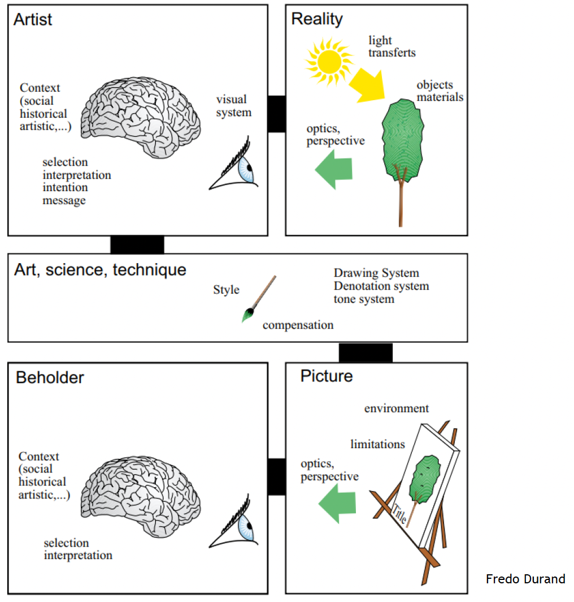

Este diagrama explora cómo una imagen es percibida y creada desde diferentes puntos de vista: la realidad, el artista, la técnica y el espectador. A continuación se explican los puntos clave.

**Realidad**
- **Luz y objetos**: La luz refleja los objetos y materiales, transportando la información hacia el ojo (en el caso del ser humano) o hacia un sensor (en el caso de la visión por computador).
- **Óptica y perspectiva**: Estos factores influyen en cómo se captura y percibe la escena.

**Artista**
- **Contexto y percepción**: El artista, influenciado por un contexto social e histórico, interpreta la realidad visualmente. Selecciona y omite elementos para transmitir un mensaje o intención.
- **Sistema visual**: El cerebro procesa la información visual según la intención y el mensaje deseado.

**Arte, ciencia y técnica**
- **Estilo y compensación**: El artista aplica técnicas, como el dibujo y los sistemas de tono, para compensar las limitaciones de la perspectiva y óptica, creando una representación artística de la realidad.
- **Sistemas de denotación**: Los métodos científicos o artísticos que se usan para describir y simplificar la realidad.

**Espectador**
- **Contexto y percepción**: Similar al artista, el espectador interpreta la imagen a través de su propio contexto histórico, social y artístico. Su cerebro selecciona e interpreta lo que observa.
- **Selección e interpretación**: Cada espectador puede tener una interpretación única de la imagen basada en su experiencia.

**Imagen final**
- **Entorno y limitaciones**: La imagen está condicionada por el entorno donde se presenta (por ejemplo, una pintura en una galería o una fotografía en una pantalla) y las limitaciones técnicas (resolución, color, etc.).
- **Óptica y perspectiva**: Estos elementos continúan influyendo en la percepción final del espectador.


## Digital Cameras

La cámara _sustituye_ al ojo.

Cámara digital: 
* Conos y bastones -> CCD o CMOS
* Células ganglionares -> Banco de filtros

<src img="img/camara_digital.png" height="300" alt="Cámara digital">

- **Digital Image Formation**  
  A digital image is formed by capturing light and converting it into electrical signals via sensors like CCD or CMOS.
  - Structure of digital images based on pixels.
  - Light intensity measured as a function of coordinates.
  - Concept of discretization, where continuous data (light) is converted into a digital format.

## Imagen digital

El **píxel**: "Un píxel es una muestra puntual, es decir, el valor de algo continuo en un punto (con dimensión cero). Si simplemente esto fuera entendido, podríamos evitar para siempre el error de considerar un píxel como un pequeño cuadrado." (Alvy Ray Smith, creador de Paint)

* Imagen como función intensidad de la luz
* `f(x,y)` proporcional al brillo/energía, `x` e `y` coordenadas
* Número de posiciones finitas
* Tercera componente `t` (tiempo): vídeo
* Almacenamiento no analógico sino digital
+ Discretización señal analógica captada por el sensor
* Proyección 2D de escena 3D
* [Frustum](https://docs.unity3d.com/es/2018.4/Manual/UnderstandingFrustum.html)

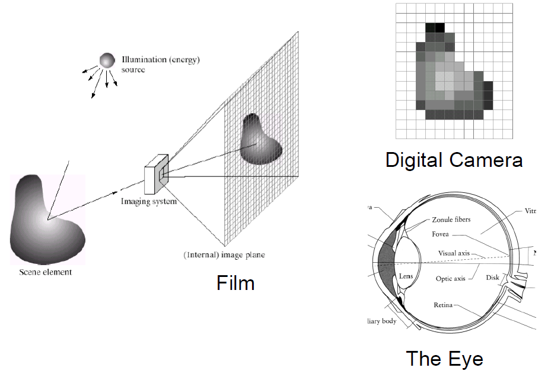

Almacenar en memoria requiere discretizar:
* Muestreo espacial (2D), lo normal equiespaciado (Frecuencia)
* Cuantizar, obtener valores numéricos

Facilita el procesamiento y análisis de la imagen.

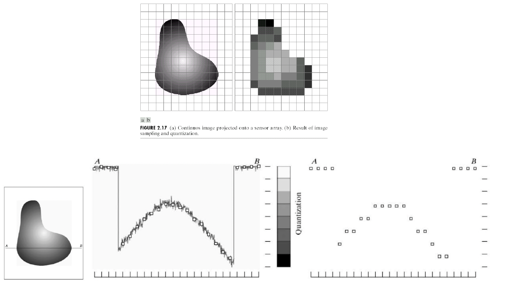

* Discretizar pierde información
* Impide recuperar señar original
* Un sistema digital se considera muy preciso, ¿por qué?

Interpolación: estimar valores intermedios a partir de los discretos.

Calidad imagen digital:
* resolución (número de píxeles)
* número de bits por píxel

Aliasing: fenómeno de distorsión de la imagen por muestreo insuficiente.

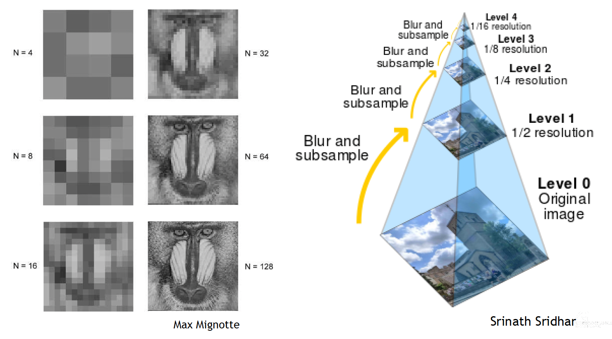

Aliasing espacial y muestreo
**Aliasing espacial**

El aliasing espacial es una forma específica de aliasing que afecta principalmente a la representación visual de los detalles espaciales, es decir, las variaciones en los objetos de una imagen en términos de su tamaño, forma o textura.

Artefactos comunes:

* **Patrones de moiré**: Patrones ondulados o irregulares que aparecen cuando los detalles finos de una imagen se superponen de manera errónea con los píxeles.

* **Distorsiones geométricas**: Los objetos en la imagen pueden aparecer distorsionados en formas inusuales.

Soluciones:
* Aumentar la frecuencia de muestreo o la resolución de la imagen.
* Aplicar un filtro anti-aliasing (filtro de paso bajo) para suavizar las frecuencias altas que el sistema no puede captar.

**Aliasing temporal y muestreo**

El aliasing temporal ocurre en imágenes en movimiento o en video cuando la frecuencia de muestreo (tasa de cuadros por segundo) es insuficiente para capturar adecuadamente el movimiento de los objetos. Esto produce efectos no deseados como:

* **Strobing**: Efecto donde un objeto en movimiento parece moverse a saltos en lugar de hacerlo de manera suave y continua.
* **Efecto wagon-wheel**: Donde las ruedas de un carro o cualquier objeto en rotación parecen moverse en dirección opuesta o detenerse, debido a una frecuencia de muestreo (fps) baja comparada con la velocidad del movimiento.

Ejemplo:

* Si grabas un video a 24 fps de un ventilador girando a gran velocidad, sus aspas pueden parecer que giran hacia atrás o que se detienen por completo, cuando en realidad siguen en movimiento.

Solución:

* Aumentar la tasa de cuadros por segundo (fps) para capturar con mayor precisión el movimiento.

* Utilizar técnicas de interpolación o motion blur para suavizar el movimiento en la imagen y reducir el aliasing temporal.

**Matriz Numérica Bidimensional y Niveles de Gris**

- **Imagen digital**: Una imagen en blanco y negro o en escala de grises puede representarse como una matriz numérica bidimensional.
- **Matriz**: Cada número en la matriz representa el valor de brillo de un píxel, donde 0 es negro y 255 es blanco, con valores intermedios representando diferentes tonos de gris.
- **Resolución de la imagen**: Esta matriz de 8 bits por píxel permite 256 niveles de gris (2^8 = 256), lo que proporciona una representación precisa de las tonalidades en la imagen.

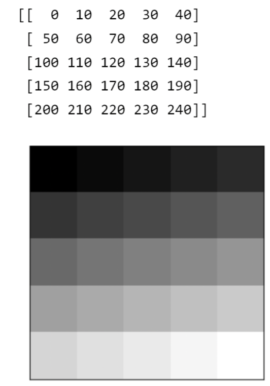


**Resolución de Sensor y Combinaciones Posibles**

- **Resolución del sensor**: Una imagen de 256x256 píxeles tiene 65,536 píxeles en total.
- **Combinaciones posibles**: Como cada píxel puede tener 256 valores diferentes (en una imagen de 8 bits), el número total de combinaciones posibles de valores de píxeles en una imagen de 256x256 es 256^65536, lo que indica un espacio de altísima dimensión. Este concepto es fundamental para entender la complejidad del procesamiento de imágenes en visión por computador.

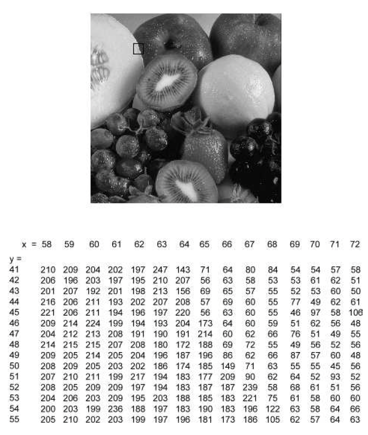

**Imagen a Color: RGB y Espacios de Color**

- **Imágenes a color**: Una imagen en color se representa con tres matrices o planos (R, G y B), que contienen la información de los componentes de color rojo, verde y azul.
- **Bits por píxel**: En una imagen a color, cada píxel tiene 24 bits (8 bits para cada componente de color), lo que permite 16,777,216 combinaciones posibles de color (2^24).
- **Espacios de color**: El más común es RGB, pero se pueden usar otros espacios de color como HSV, dependiendo de la aplicación de visión por computador.

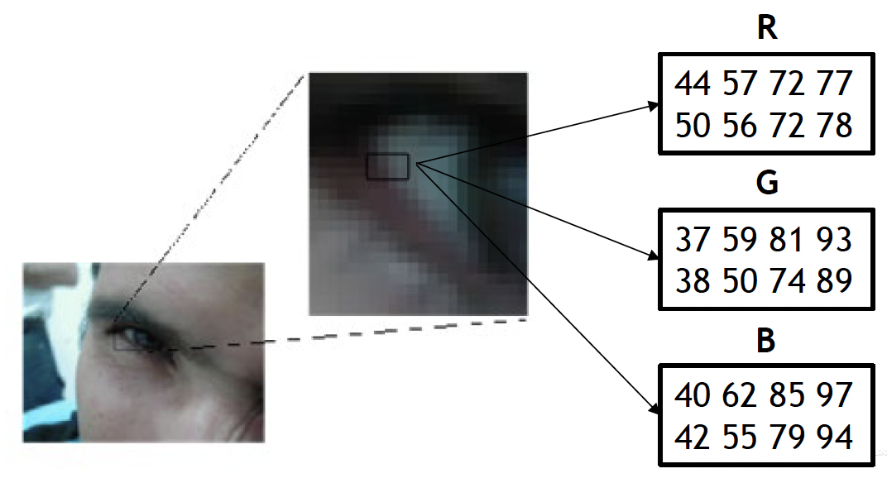
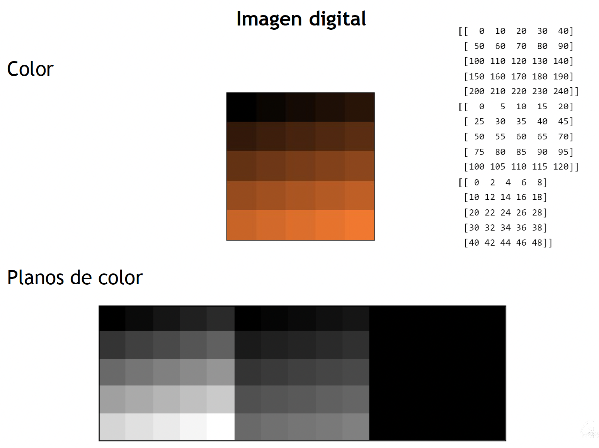

**Planos de Color en Imágenes**

- **Promedio**: Una forma básica de convertir una imagen en color a escala de grises es promediando los valores de R, G y B.

```python
gray = (R + G + B) / 3
```

- **Estándar BT.601**: Este estándar usa un cálculo ponderado donde el verde tiene mayor influencia (0.587), seguido por el rojo (0.299) y el azul (0.114), reflejando la sensibilidad del ojo humano a diferentes colores.

```python
gray = 0.299 * R + 0.587 * G + 0.114 * B
```

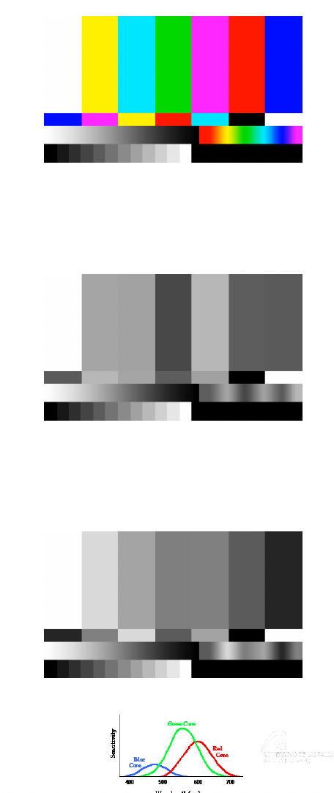

### Histograma de una Imagen

- **Histograma**: El histograma de una imagen es la <u>representación gráfica de la distribución de las intensidades de los píxeles</u>. 
- **Normalización**: Para facilitar el análisis y mejorar los resultados en procesamiento de imágenes, el histograma puede ser normalizado (dividiendo la frecuencia de cada bin por el número total de píxeles).
- El histograma muestra cuántos píxeles tienen una intensidad particular en una imagen en escala de grises, útil para operaciones como ajuste de contraste o umbralización.

### Umbralización con Histograma

- **Umbralización**: <u>Proceso de convertir una imagen en escala de grises en una imagen binaria (blanco y negro) mediante un valor de umbral</u>.
- El código Python presentado utiliza `scipy.signal` para encontrar los picos en el histograma, ordenarlos y establecer un valor de umbral que se aplica a la imagen.
- Esta técnica se usa comúnmente para segmentación de objetos en imágenes, donde se distingue entre fondo y primer plano.

```python
from scipy.signal import find_peaks

#Convierte en vector fila
hist = hist.flatten()

#Máximos locales, ordena índices por valor
picos, _ = find_peaks(hist, distance=20)
picos_ordenados = sorted(picos, key=lambda x: hist[x], reverse=True)

pico1, pico2 = picos_ordenados[:2]

#Busca mínimo (valor de gris) entre picos
if pico2 < pico1:
    pico1, pico2 = pico2, pico1

valle = np.argmin(hist[pico1:pico2]) + pico1

#Umbraliza con posición del mínimo
res, imagenUmbralizada = cv2.threshold(gris, valle, 255, cv2.THRESH_BINARY)

plt.imshow(imagenUmbralizada, cmap='gray')
plt.show()
```    

### Sensores

**Captura de la Imagen: Del Ojo Humano a los Sensores**

- **Ojo humano vs. cámaras**: La captura de imágenes en el ojo humano y las cámaras digitales sigue principios similares:
  - El **ojo humano**: La luz pasa a través de la lente y es procesada en la retina, donde los conos y bastones convierten la luz en señales eléctricas.
  - **Cámaras digitales**: La luz pasa por la lente y llega al sensor CMOS/CCD, que convierte la imagen óptica en señales eléctricas que pueden ser procesadas digitalmente.

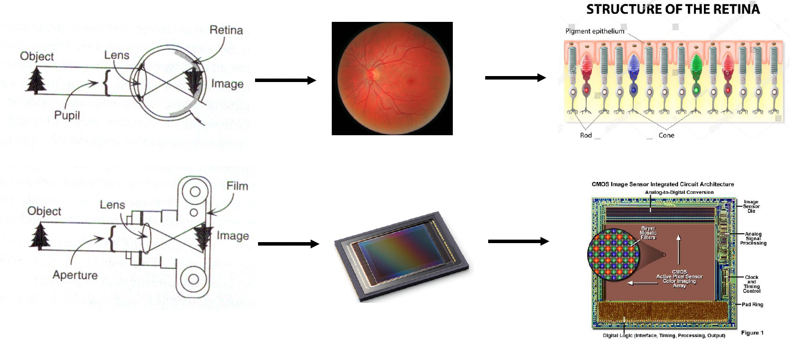

**Sensores: Rango Visible y Sensibilidad**

- **Rango visible**: El espectro de luz visible está comprendido entre los 400-700 nm, y las cámaras y sensores humanos están diseñados para captar este rango.
- **Sensibilidad del ojo humano**: Los conos del ojo son más sensibles en ciertos rangos del espectro visible (rojo, verde y azul). Esto influye en cómo captamos los colores y en cómo los sensores de cámara replican esta sensibilidad.

**Factores que Afectan el Color de los Objetos**

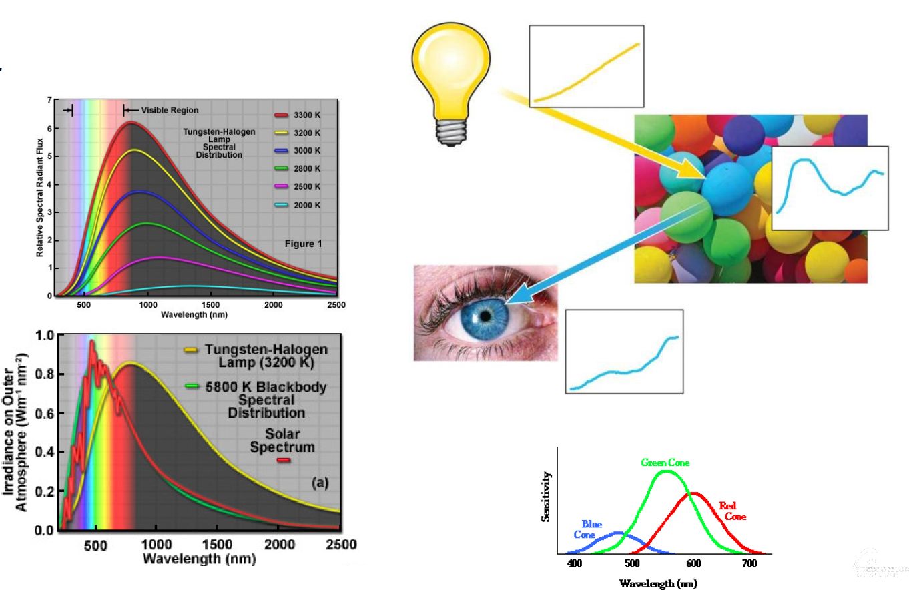

- **Espectro de reflectancia**: La luz que se refleja en los objetos depende de las propiedades de la superficie del objeto, la fuente de luz y el sensor utilizado para capturar la imagen.

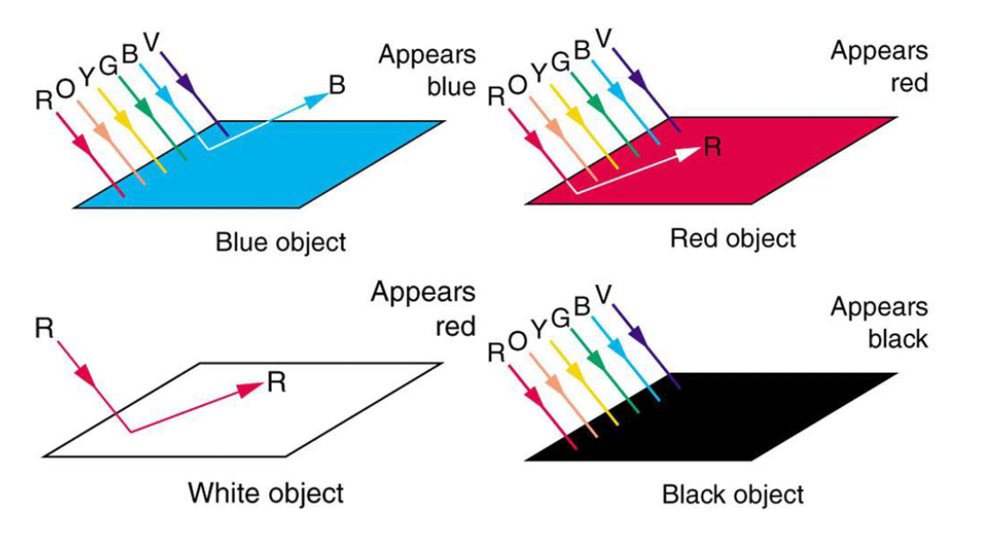

- **Corrección de color**: El balance de blancos es una técnica utilizada en cámaras digitales para corregir las variaciones de color producidas por diferentes condiciones de iluminación.


#### Tipos de Sensores: CCD y CMOS

- **CCD (Charge Coupled Device)**: Este tipo de sensor es más costoso y consume más energía, pero produce imágenes de alta calidad.
  - Calidad de Imagen: Ofrece imágenes de alta calidad con menor ruido y excelente reproducción de colores.
  - Consumo de Energía: Consume más energía, lo que puede afectar la duración de la batería en dispositivos portátiles.
  - Costo: Generalmente más costoso debido a su tecnología más compleja.
  - Aplicaciones: Utilizado en cámaras profesionales y equipos científicos donde la calidad de imagen es primordial.
- **CMOS (Complementary Metal-Oxide-Semiconductor)**: Es más frecuente en dispositivos modernos, consume menos energía y es más económico, pero la calidad de imagen puede ser ligeramente inferior en comparación con los CCD.
  - Eficiencia Energética: Consume menos energía, lo que lo hace ideal para dispositivos móviles y cámaras compactas.
  - Costo: Más económico de fabricar, permitiendo precios más accesibles en productos finales.
  - Integración: Permite integrar funciones adicionales directamente en el chip del sensor, mejorando la velocidad y funcionalidad.
  - Calidad de Imagen: Aunque ha mejorado significativamente, puede presentar una calidad de imagen ligeramente inferior comparado con los CCD, especialmente en condiciones de poca luz.
- **Foveon X3**: Un tipo de sensor que capta directamente los tres colores primarios en cada píxel, lo que mejora la calidad de la imagen en comparación con la interpolación que ocurre en sensores de tipo Bayer.
  - Captura de Color: Captura directamente los tres colores primarios (rojo, verde y azul) en cada píxel, eliminando la necesidad de interpolación de color.
  - Calidad de Imagen: Ofrece una reproducción de colores más precisa y detallada, con mayor nitidez y profundidad.
  - Tecnología: Utiliza una estructura de capas para captar cada color, lo que difiere de los sensores tradicionales de tipo Bayer.
  - Aplicaciones: Preferido en cámaras que buscan una alta fidelidad de color y detalle, aunque puede ser más costoso y tener limitaciones en condiciones de poca luz.

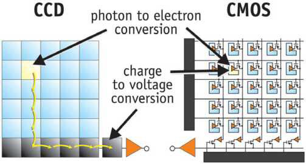
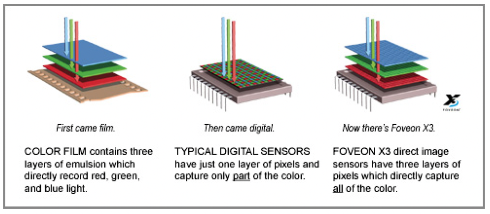


**Rejilla de Bayer y Filtros de Color**

- **Rejilla de Bayer**: Disposición de filtros de color en sensores de imagen que captura la luz en rojo, verde y azul. La mayoría de los sensores usan este sistema y luego interpolan los colores faltantes en cada píxel.
- **Interpolación**: Los píxeles en la imagen final son generados interpolando los valores faltantes de color de los píxeles adyacentes. La matriz tiene más píxeles verdes debido a la mayor sensibilidad del ojo humano a la luminancia verde.

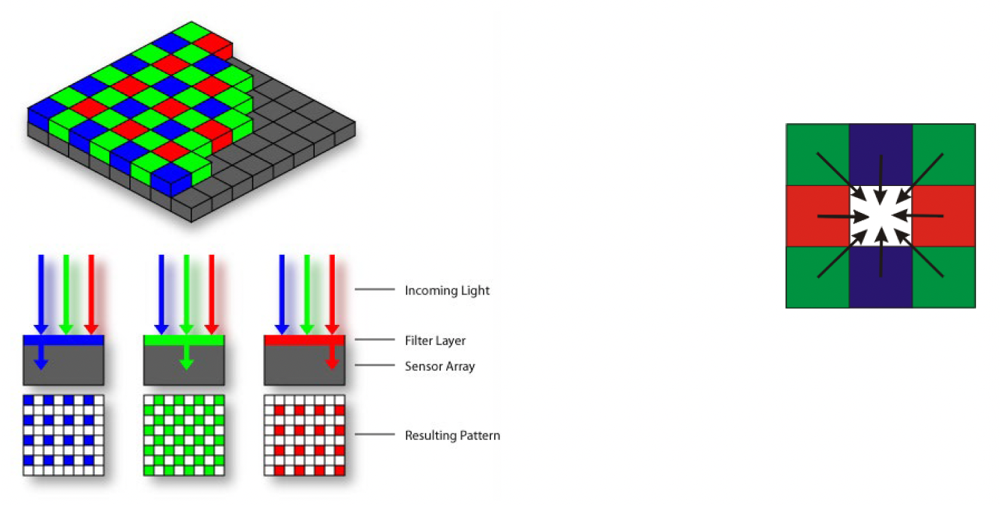

**Luminancia y el Color Verde**

- **Sensibilidad a la luminancia**: El verde tiene un mayor peso en la percepción de la luminancia por el ojo humano, razón por la cual los sensores de imagen suelen captar más información verde en comparación con el rojo y azul.
- La **rejilla de Bayer** refleja esta realidad, dándole más espacio a píxeles verdes para mejorar la captura de detalles en la imagen.

**Problemas**

* Ruido 
* Resolución
* Procesamiento en sensor
* Falsos colores
* Aberraciones cromáticas
* Raw vs. comprimido (calidad y tamaño)
* Balance de blanco

**Entrelazado vs Progresivo**

- **Entrelazado**: Captura alternada de líneas impares y pares de una imagen. Se usaba en TV analógica debido a limitaciones de ancho de banda. El efecto de entrelazado no es detectado por el ojo humano (fenómeno Phi).
- **Progresivo**: Captura todas las líneas de una imagen en un solo barrido. Proporciona una mayor calidad de imagen, pero requiere mayor ancho de banda.

**Búsqueda de Mejores Sensores**

- **Sensores actuales**: Constantemente se desarrollan nuevos sensores que buscan mayor calidad y eficiencia. Se están probando nuevas distribuciones de píxeles y microlentes.
- **Cámaras plenópticas**: Capturan tanto la dirección como la intensidad de la luz, lo que permite refocalización post-captura. Integran microlentes que distribuyen la luz hacia un sensor especializado.

### Representación

**Espacios de Color**

- **Modelos de color**: Los espacios de color más comunes utilizan tres colores primarios (RGB para pantallas, CMYK para impresión).
- **Aditivo vs. Sustractivo**: Los modelos aditivos mezclan luz (RGB), mientras que los sustractivos mezclan pigmentos (CMY).

**Espacios de Color Perceptualmente Uniformes**

- **Espacios de color**: Los más comunes son RGB, HSV, CIE, YCbCr y L*a*b*.
- **Uniformidad perceptual**: Algunos espacios como L*a*b* están diseñados para que las diferencias de color percibidas correspondan directamente a distancias en el espacio de color.


**Espacios de Color en OpenCV: HSV**

- **HSV (Hue, Saturation, Value)**: Este espacio de color es útil para segmentación de colores, ya que separa el tono (color), la saturación (pureza del color) y el brillo.
  - H (0-179): Matiz
  - S (0-255): Saturación
  - V (0-255): Brillo
- **OpenCV**: Permite trabajar fácilmente con imágenes en HSV y realizar operaciones de segmentación como la detección de zonas rojas (ver código ejemplo en la diapositiva).


**Psicología y Armonía del Color**

- **Armonía de colores**: Se basa en combinaciones de colores que resultan agradables a la vista (complementarios, triádicos, etc.).
- **Accesibilidad**: Considera la percepción del color para personas con daltonismo (ver patrones de Ishihara en la imagen).
- **Patrones de color**: Los colores no solo transmiten información estética, sino también psicológica y funcional.

#### Gráficos Monocromáticos y Dithering

- **Medios tonos y dithering**: Técnicas usadas en gráficos monocromáticos para simular distintos niveles de gris mediante la disposición de puntos de tinta (dithering) o el uso de patrones de dos tonos.
- **Aplicación**: Estas técnicas fueron ampliamente utilizadas en impresoras de tinta y pantallas monocromáticas.

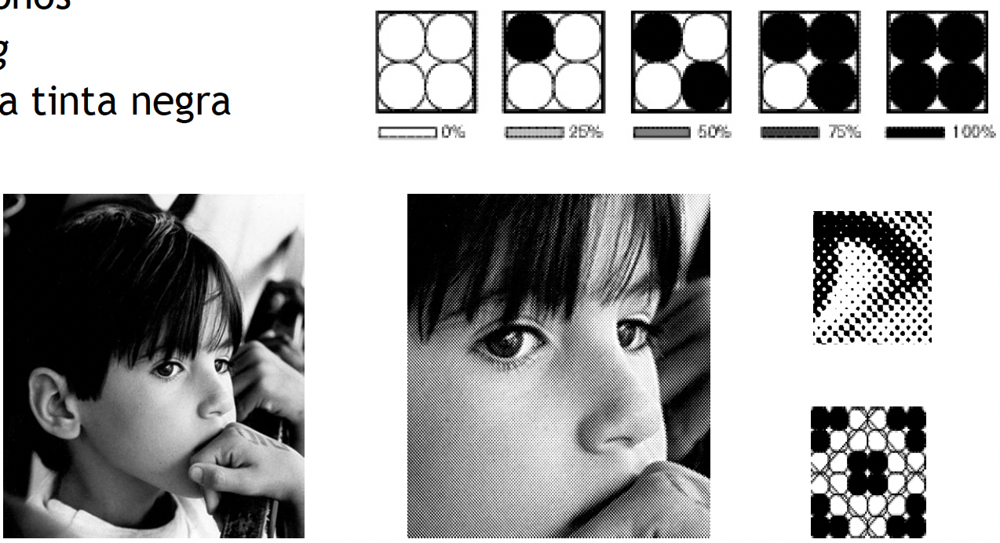

#### Representación: Mapas de Color y Color Indexado

- **Mapas de color**: Representan imágenes en un espacio reducido de colores donde cada color tiene un índice. Esto permite una mayor compresión.
- **Mapa de color jet**: Un ejemplo común en visualización de datos, donde los valores numéricos se representan con colores en un rango predefinido (ver imagen).

## Formación

**¿Cómo se captura? La creación de la imagen**

En esta sección se explica cómo el ojo humano y una cámara capturan imágenes.

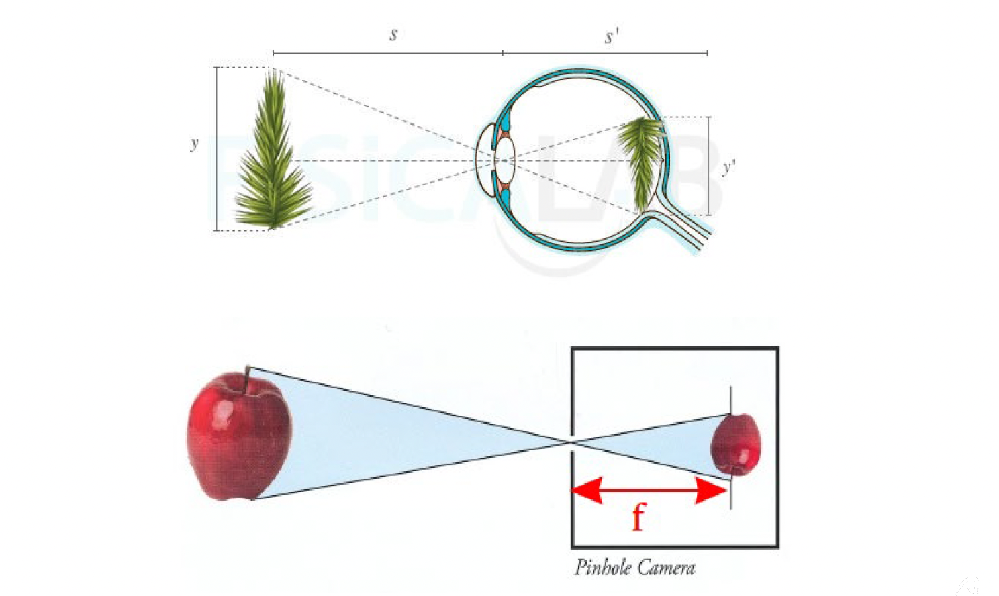

* Ojo humano: La luz proveniente de un objeto entra al ojo, es refractada por el cristalino y proyectada invertida en la retina.

* Cámara de orificio (pinhole): Funciona de manera similar al ojo. La luz pasa a través de un pequeño agujero y se proyecta una imagen invertida sobre una superficie (film o sensor). El principio básico es el mismo en ambas situaciones: la luz viaja en línea recta.

**Creación de la imagen**

Aquí se ilustra la proyección de una escena tridimensional en un plano 2D, que es lo que hace una cámara o el ojo al capturar una imagen. Se utiliza la geometría de perspectiva, donde los rayos de luz desde diferentes puntos de un objeto convergen en el lente o el punto de proyección, formando una imagen en el plano focal.

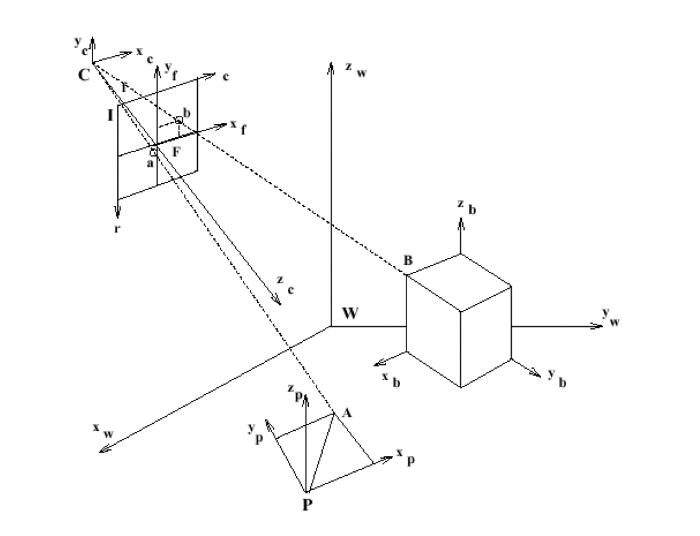

**Camera obscura y Camera lucida**

* **Camera obscura**: Es un dispositivo óptico antiguo, precursor de la cámara fotográfica moderna. Consiste en una caja oscura con un pequeño agujero en un lado. La luz que entra proyecta una imagen invertida en la pared opuesta. Es un ejemplo temprano del uso de principios ópticos para crear imágenes.

* **Camera lucida**: Dispositivo utilizado por artistas que permite ver simultáneamente la escena y el dibujo, facilitando el proceso de dibujo realista.

### Modelo de cámara

La cámara de orificio o pinhole es un modelo simple de cámara. Tiene una apertura pequeña (agujero) por donde pasa la luz, proyectando una imagen invertida sobre el plano de imagen. La imagen virtual, en cambio, no está invertida y es el concepto que se utiliza para las cámaras modernas.

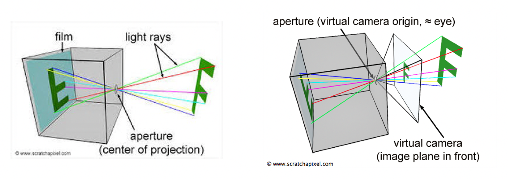

**Abertura y nitidez de la imagen**

La abertura controla la cantidad de luz que entra a la cámara y afecta la nitidez de la imagen. Cuanto más pequeña es la abertura, más nítida será la imagen, pero menos luz entra, lo que puede requerir exposiciones más largas.

**Transformación de 3D a 2D**

Cuando una cámara captura una imagen, transforma el espacio tridimensional en una representación bidimensional. Esta proyección puede formalizarse mediante geometría de perspectiva, donde los objetos más lejanos parecen más pequeños, imitando cómo los percibimos en la realidad.

**Perspectiva, focal y distancias**

La perspectiva muestra cómo los objetos más alejados parecen más pequeños en comparación con los cercanos. La longitud focal afecta este efecto: una distancia focal corta hace que los objetos cercanos parezcan más distantes entre sí, mientras que una distancia focal larga comprime la escena.

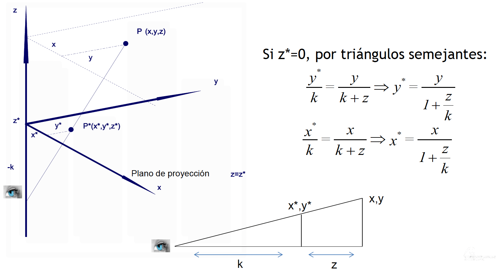

**Paralelas y puntos de fuga**

En la geometría de perspectiva, las líneas paralelas parecen converger en un punto de fuga a medida que se alejan en la distancia. Este fenómeno se usa en fotografía y arte para dar una sensación de profundidad.

**Focal y retratos**

La distancia focal también influye en cómo se ven las personas en los retratos. Una distancia focal más corta, como 20 mm, puede distorsionar los rasgos faciales, mientras que una distancia focal más larga (por ejemplo, 85 mm) proporciona una imagen más natural y favorecedora.

**Parámetros extrínsecos**:

* Traslación: El movimiento de la cámara a lo largo de los ejes de coordenadas (X, Y, Z).
* Rotación: Rotación de la cámara alrededor de un punto.

**Parámetros intrínsecos**:

* **Óptica**: Parámetros relacionados con la lente de la cámara.
* **Geometría**: Incluye factores como la distancia focal y la distorsión radial.
* **Digital**: Resolución del sensor y el procesamiento interno.

### Traslación
La traslación se puede representar como un desplazamiento de la cámara en el espacio 3D, ajustando las coordenadas del punto en relación a su nueva posición.

La fórmula básica para la traslación en 3D es:

```math
P' = (x', y', z') = (x + a, y + b, z + c)
```

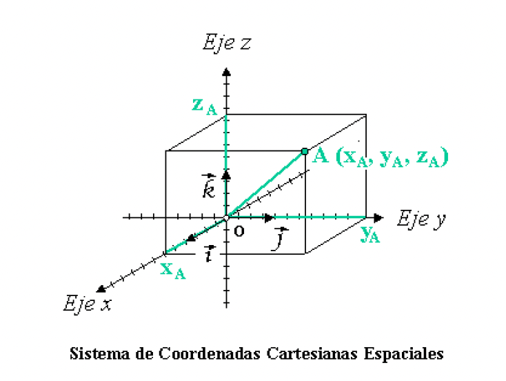

### Rotación

Dos posibles configuraciones de ejes:

* Levógiro
* Dextrógiro

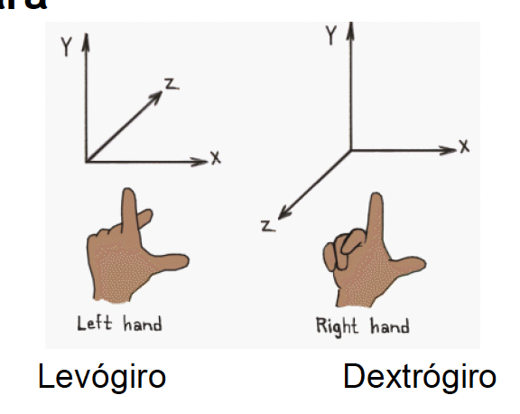

A rotation matrix is a matrix that is used to perform a rotation in Euclidean space. In 3D space, rotation matrices are **3×3** matrices. The general form of a rotation matrix **R** is:

```math

\mathbf{R} = \begin{bmatrix}
r_{11} & r_{12} & r_{13} \\
r_{21} & r_{22} & r_{23} \\
r_{31} & r_{32} & r_{33}
\end{bmatrix}
````

#### Rotation Around the X-Axis

Rotating a point around the **X-axis** by an angle **θ** is represented by the matrix **Rₓ(θ)**:

```math
\mathbf{R}_x(\theta) = \begin{bmatrix}
1 & 0 & 0 & 0 \\
0 & \cos\theta & -\sin\theta & 0 \\
0 & \sin\theta & \cos\theta & 0 \\
0 & 0 & 0 & 1
\end{bmatrix}
```

**Explanation:**

- The X-coordinate remains unchanged.
- The Y and Z coordinates are rotated in the YZ-plane.

#### Rotation Around the Y-Axis

Rotating around the **Y-axis** by an angle **θ** uses the matrix **R_y(θ)**:

```math
\mathbf{R}_y(\theta) = \begin{bmatrix}
\cos\theta & 0 & -\sin\theta & 0\\
0 & 1 & 0 & 0\\
\sin\theta & 0 & \cos\theta & 0\\
0 & 0 & 0 & 1
\end{bmatrix}
```

**Explanation:**

- The Y-coordinate remains unchanged.
- The X and Z coordinates are rotated in the XZ-plane.

### Rotation Around the Z-Axis

For rotation around the **Z-axis** by an angle **θ**, the matrix **R_z(θ)** is:

```math
[
\mathbf{R}_z(\theta) = \begin{bmatrix}
\cos\theta & \sin\theta & 0 & 0\\
-\sin\theta & \cos\theta & 0 & 0\\
0 & 0 & 1 & 0 \\
0 & 0 & 0 & 1
\end{bmatrix}
]
```

**Explanation:**

- The Z-coordinate remains unchanged.
- The X and Y coordinates are rotated in the XY-plane.

#### Homogeneous Transformation Matrix

Assuming no translation between frames, the homogeneous transformation matrix 

```math
\mathbf{M}_{BA}` 
```

is:

```math
\mathbf{M}_{BA} = \begin{bmatrix}
0 & 0 & 1 & 0 \\
0 & 1 & 0 & 0 \\
-1 & 0 & 0 & 0 \\
0 & 0 & 0 & 1
\end{bmatrix}
```

#### Transforming a Point from Frame A to Frame B

Given a point 

```math
\mathbf{P}_A
```

in frame **A**:

```math
\mathbf{P}_A = \begin{bmatrix}
x \\
y \\
z \\
1
\end{bmatrix}
```

The point in frame **B** is obtained by:

```math
\mathbf{P}_B = \mathbf{M}_{BA} \mathbf{P}_A
```

**Explanation:**

- **First row**: 
```math
x_B = 0 \cdot x + 0 \cdot y + 1 \cdot z + 0 \cdot 1 = z
```
- **Second row**: 
```math
y_B = 0 \cdot x + 1 \cdot y + 0 \cdot z + 0 \cdot 1 = y
```
- **Third row**: 
```math
z_B = -1 \cdot x + 0 \cdot y + 0 \cdot z + 0 \cdot 1 = -x
```

#### Composición de transformaciones

* No conmutativo

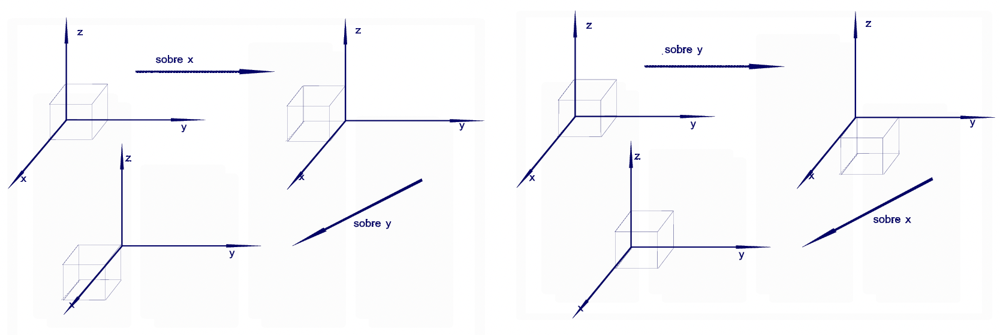

### Pin hole

El modelo pinhole utiliza una apertura extremadamente pequeña (agujero) para capturar imágenes. Sin embargo, existen limitaciones debido al tamaño de este agujero:

* Si el agujero es demasiado grande, la imagen se vuelve borrosa.
* Si el agujero es demasiado pequeño, la imagen se oscurece y pierde nitidez debido a la difracción.

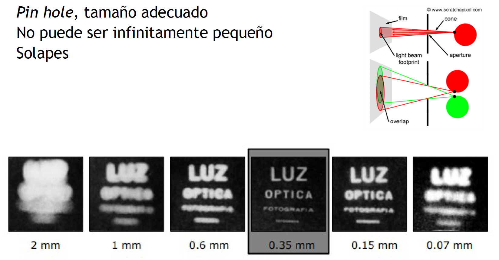

### Lentes

El pinhole requiere largos tiempos de exposición porque deja pasar muy poca luz. Las lentes mejoran la captura de imagen al permitir más luz y enfoque preciso.

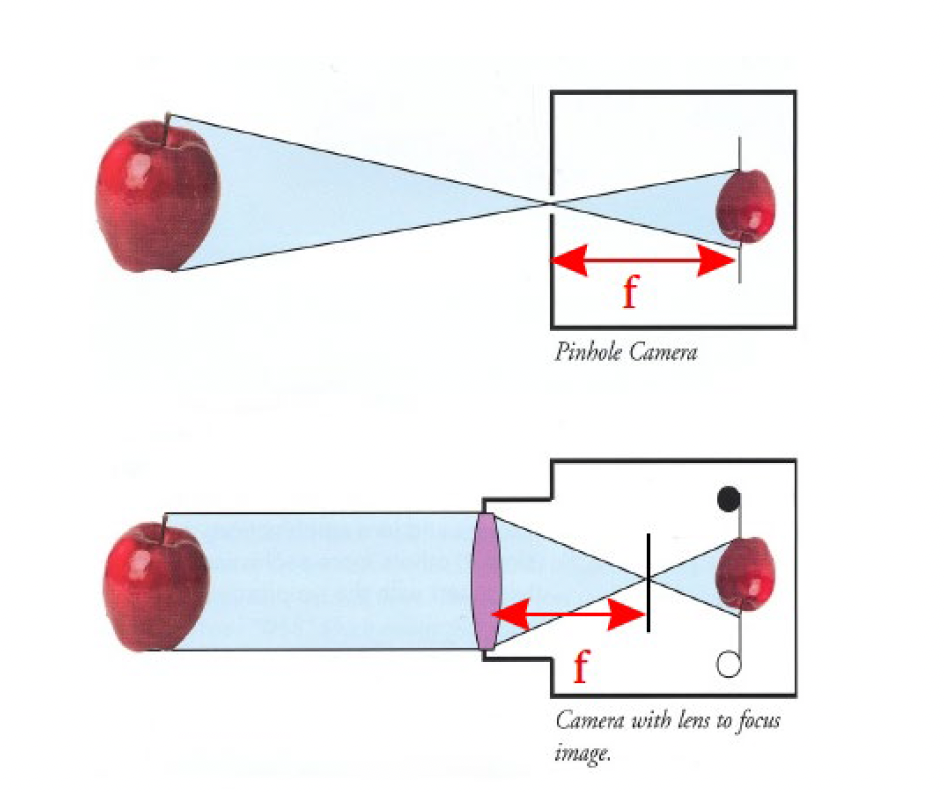

Proyección con lente

Al usar una lente en vez de un agujero pequeño, se consigue un mayor paso de luz con una proyección similar, permitiendo tiempos de exposición más cortos.

La fórmula para calcular la distancia focal de una lente es:

```math
\frac{1}{f} = \frac{1}{d_o} + \frac{1}{d_i}
```
Donde:

* **f**: Distancia focal de la lente.
* **d_o**: Distancia del objeto a la lente.
* **d_i**: Distancia de la imagen a la lente.

---

Una lente tiene el problema de que solo un plano puede estar completamente enfocado. La **profundidad de campo** (_depth of field_) define qué partes de la imagen se ven nítidas.

* Al reducir la apertura (mayor número f, como f/8.0), se aumenta la profundidad de campo y más áreas de la imagen estarán enfocadas.

* Con aperturas más grandes (f/2.8), solo una pequeña parte estará enfocada y el resto aparecerá desenfocado (efecto bokeh).

--- 

Las lentes también introducen **distorsiones geométricas**:

* Distorsión de cojín: Los bordes de la imagen parecen comprimidos hacia el centro.
* Distorsión de barril: Los bordes parecen inflarse hacia afuera.

--- 

Las lentes pueden introducir **aberración cromática**, que ocurre cuando diferentes longitudes de onda de la luz se refractan de manera distinta al pasar a través de la lente. Esto provoca bordes de colores o imágenes desenfocadas en los bordes de la imagen.

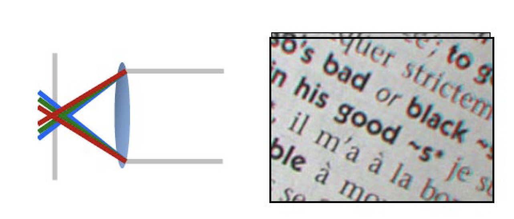

### Fotometría

En la visión por computadora no solo es importante la geometría, sino también la interacción de la luz con los objetos. Los modelos de Fotometría incluyen:

* **Luz reflejada**: La luz reflejada de los objetos llega al sensor de la cámara.
* **Espectro y geometría de las fuentes de luz**: Diferentes longitudes de onda de luz reflejada.
* **BRDF (Bidirectional Reflectance Distribution Function)**: Función que describe cómo la luz se refleja en diferentes materiales. Es crucial para simular imágenes en gráficos por computadora (CG).

## Bibliography
- Gombrich, E.H., *Art & Illusion*.
- Szeliski, R., *Computer Vision: Algorithms and Applications*.
- Nayar, S., *Image Formation*.
