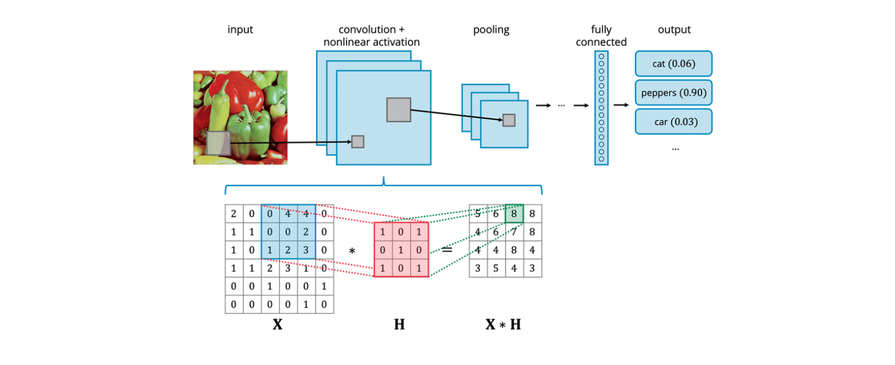
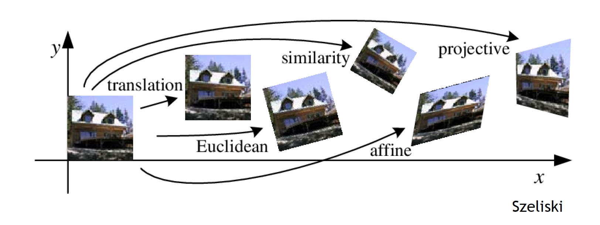

# Image Processing

# Image Processing

## Table of Contents

- [Image Processing](#image-processing)
- [Image Processing](#image-processing-1)
  - [Table of Contents](#table-of-contents)
  - [Operators:](#operators)
  - [Puntuales](#puntuales)
    - [Figure/Background:](#figurebackground)
      - [**Umbralizado** (***Thresholding***)](#umbralizado-thresholding)
    - [Contrast:](#contrast)
  - [Filters:](#filters)
    - [Gaussian Filter:](#gaussian-filter)
      - [Sobel Filter:](#sobel-filter)
      - [Laplacian Filter:](#laplacian-filter)
      - [Integral Image:](#integral-image)
    - [Non-Linear Filters:](#non-linear-filters)
      - [Median Filter:](#median-filter)
      - [Percentile Filtering:](#percentile-filtering)
      - [Bilateral Filter:](#bilateral-filter)
      - [Binary Image Operations:](#binary-image-operations)
      - [Distance Transform:](#distance-transform)
      - [CNNs](#cnns)
      - [Pyramids:](#pyramids)
      - [Geometric Operations:](#geometric-operations)
  - [Transforms:](#transforms)
    - [Fourier Transform:](#fourier-transform)

## Operators:

An operator transforms one or more input images into an output image.

Transforma una, f, o varias imágenes, fi, en una imagen de salida, g

```math
g = T(f(x))
```

```math
g = T(f_1(x), f_2(x), ..., f_n(x))
```

* Types of operators include 
  * pixel/point, 
  * local (filtering), 
  * and geometric.

## Puntuales

* These operators depend on the brightness/colour of the pixel itself.
* The same operation is performed for all pixels.

```math
g(x, y) = T(f(x, y))
```

Examples include:

* **Additive/Subtractive**: Adding or subtracting a constant value to lighten or darken an image.
* **Inversion**: Inverting the pixel values.
  
  ```math
    g(x, y) = 255 - f(x, y)
  ```

* **Product**: Multiplying by a value to increase (>1) or decrease (<1) contrast.

    ```math
    g(x, y) = T(f(x, y)) = c * f(x, y)
    ```
* **Combination**: Combining two images, such as averaging or alpha blending.

    ```math
    g(x, y) = (f_1(x, y) + f_2(x, y)) / 2
    ```

  * Alpha blending allows for transparency effects.
  
    ```math
    g(x, y) = \alpha f_1(x, y) + (1 - \alpha) f_2(x, y)
    ```

Colour planes can be used for combination, such as extracting a specific colour ## range.

```python
imgrgb = cv2.cvtColor(img, cv2.COLOR_BGR2RGB)
imghsv = cv2.cvtColor(img, cv2.COLOR_BGR2HSV)
gris = cv2.cvtColor(img, cv2.COLOR_BGR2GRAY)

#Máscara rango rojo y extracción desde imgrgb
mask = cv2.inRange(imghsv, (0, 120, 70), (10, 255, 255))
imgmasked = cv2.bitwise_and(imgrgb, imgrgb, mask=mask)

#Máscara inversa (sin rojo) y extracción desde gris
mask_inv = cv2.bitwise_not(mask)
background = cv2.bitwise_and(gris, gris, mask = mask_inv)

#Convierte a tres canales y combina
background = cv2.merge([background,background,background])
added_img = cv2.add(imgmasked, background)
```


Colour:

* RGB colour ranges are not perceptually uniform.
* Conversion between colour spaces, such as RGB/BGR to HSV, is possible.

### Figure/Background:

Techniques for separating the figure from the background include:

#### **Umbralizado** (***Thresholding***)

Assigning a value based on a condition, often using the histogram to determine the threshold.

* Options include fixed thresholding and automated threshold selection (e.g. `Otsu's` method).

* Adaptive thresholding adjusts the threshold locally based on the neighbourhood.

Opciones `cv2.threshold`:
```python
cv.THRESH_BINARY
cv.THRESH_BINARY_INV
cv.THRESH_TRUNC
cv.THRESH_TOZERO
cv.THRESH_TOZERO_INV
```

Other schemes and scenarios are also used.

**`Otsu's` method**:

```python
# Umbralizado invertido, se asume objetos en blanco
-,imth1 = cv2.threshold(gris,200,255,cv2.THRESH_BINARY_INV)
# Umbral con método de Otsu
-,imth2 = cv2.threshold(gris,0,255,cv2.THRESH_BINARY_INV+cv2.THRESH_OTSU)
```


**Adaptive Thresholding** by neighbourhood:

```python
cv2.ADAPTIVE_THRESH_MEAN_C
cv2.ADAPTIVE_THRESH_GAUSSIAN_C
```

**OpenCV comparison**:


### Contrast:

Adjusting the image to utilize the maximum range.

* **Linear Contrast Stretching**: Normalizing the pixel values to the full range.

  ```math
  g(x, y) = T(f(x, y)) = \frac{f(x, y) - f_{\text{min}}}{f_{\text{max}} - f_{\text{min}}} \times 255
  ```

Histogram equalization enhances contrast by mapping the intensity to achieve a flat histogram.

Lo aplica `matplotlib.imshow` al escoger el mapa de colores `cmap='gray'`.

**Equalización de Histograma**:

* Preprocesamiento habitual para mejorar la calidad de la imagen.
* Mejora el contraste y la distribución de intensidades.
* Pretende invarianza frente a cambios de ilumnación.
* Mapear la intensidad (0<=i<=255) para obtener un histograma plano.
* Histograma, _h(i)_, de la imagen de N píxeles, integra la distribución. 

```math
c(I) = \frac{1}{N} \sum_{i=0}^{I} h(i) = c(I-1) + \frac{h(I)}{N}
```

## Filters:

Local or neighbourhood operators that are crucial for:

* Image enhancement (e.g., noise reduction, contrast enhancement, resizing).
* Information extraction (e.g., texture, edges, corners).
* Pattern detection.

### Linear Filtering

* A weighted sum of neighbouring pixel values, calculated using a kernel or impulse response.


```math
g(i, j) = \sum_{m} \sum_{n} k(m, n) f(i + n, j + m)
```

donde

* _g(i, j)_ es el píxel de salida.
* _f(i, j)_ es el píxel de entrada.
* _k(m, n)_ es el kernel.
* _m_ y _n_ son los índices del kernel.


The kernel defines the weights applied to the neighbourhood.

An example is the `box filter`, which averages the neighbourhood pixels.

* The weights are typically normalized to sum up to 1 to preserve the average brightness.

```math
g(i, j) = \sum_{m} \sum_{n} k(m, n) f(i + n, j + m) \\

n, m = [-1, 0, 1]
```


¿Qué pasaría al aplicar?

```python
import cv2
import numpy as np
from matplotlib import pyplot as plt

# Load the image
image_path = "/mnt/data/image.png"
img = cv2.imread(image_path, cv2.IMREAD_GRAYSCALE)

# Define the kernels from the image (Sobel-like filters)
kernels = [
    np.array([[0, 0, 0], [0, 1, 0], [0, 0, 0]]),
    np.array([[0, 0, 0], [0, 0, 1], [0, 0, 0]]),
    np.array([[1, 0, -1], [2, 0, -2], [1, 0, -1]]),
    np.array([[1, 2, 1], [0, 0, 0], [-1, -2, -1]])
]

# Apply the kernels to the image
results = []
for kernel in kernels:
    filtered_image = cv2.filter2D(img, -1, kernel)
    results.append(filtered_image)

# Plot the results
plt.figure(figsize=(10, 10))

titles = ['Kernel 1', 'Kernel 2', 'Kernel 3 (Sobel X)', 'Kernel 4 (Sobel Y)']

for i in range(len(results)):
    plt.subplot(2, 2, i+1)
    plt.imshow(results[i], cmap='gray')
    plt.title(titles[i])
    plt.xticks([]), plt.yticks([])

plt.tight_layout()
plt.show()
```


Different kernels can achieve various effects, such as smoothing, edge detection, 
noise removal, and image enhancement.

**Correlation**:

Dado _k_, correlación 2D:

```math
g = f \circledast k
```

```math
g(i, j) = \sum_{m= -h} \sum_{n = -h} k(m, n) f(i + n, j + m)
```

```python
h = scipy.signal.correlate2d(f, k, mode='same')
```

Similitud entre _k_ y la zona de la imagen.
Mayor valor, más similar o mayor encaje.

Convolution:

* A mathematical operation that combines two signals (image and kernel) to produce a third signal (filtered image).

* Denoted by the symbol *.

* Closely related to correlation, with the key difference being that the kernel is reflected in convolution.

Dado _k_, convolución 2D:

```math
g = f * k
```

```math
g(i, j) = \sum_{m= -h} \sum_{n = -h} k(m, n) f(i - n, j - m)
```

```python
h = scipy.signal.convolve2d(f, k, mode='same')
```

Refleja _k_ antes de correlar (cambio de signo).
Efecto de una señal sobre otra, combina en una tercera. 

Properties:

    * Commutative: a * b = b * a
    * Associative: a * (b * c) = (a * b) * c
    * Identity: There exists an identity kernel 'e' such that a * e = a


### Gaussian Filter:

* A low-pass filter that smooths the image and removes high frequencies.

Its weights are determined by the Gaussian function, with a parameter sigma `σ` that controls the amount of smoothing.

```math
G(x, y) = \frac{1}{2\pi\sigma^2} e^{-\frac{x^2 + y^2}{2\sigma^2}}
```

It is a separable filter, meaning it can be decomposed into horizontal and vertical components for efficient computation.


Filtros más complejos aplican primero Gaussiana, luego calculan primera o segunda derivada. Denomindos paso banda, quitan bajas y/o altas frecuencias.

Ejemplos:
* **Filtro de Sobel**: Aproximación de la derivada direccional de la Gaussiana.
* **Filtro Laplaciano**: Segunda derivada de la Gaussiana, resalta bordes.

#### Sobel Filter:

An edge detection filter that approximates a directional Gaussian derivative.

It can produce negative values, so shifting and scaling might be needed for visualization.


#### Laplacian Filter:

A second-derivative Gaussian filter (also known as a LoG filter) that highlights edges.
 
It is more sensitive to fine details and noise compared to the Sobel filter.


#### Integral Image:

* A technique for efficiently computing convolutions with box filters of various sizes.

* It involves pre-computing a summed area table, which allows for fast calculation of the sum of pixel values within any rectangular region.

* Used in applications like the Viola-Jones object detection framework.

```math
s(i, j) = \sum_{k = 0}^{i} \sum_{l = 0}^{j} f(k, l)
```

* Convolución con filtros de caja de forma repetitiva. 
* Precalcula la tabla de áreas sumadas (_summed area table_).
* Computo eficiente (línea de barrido)


### Non-Linear Filters:

#### Median Filter:

* No convolutivo
* Mejor respuesta con ruido _sal_ y _pimienta_ que suavizado. 
* Ordena valores vecindad del píxel
* Asigna el valor central de lista ordenada


**Effective at removing salt-and-pepper noise while preserving edges.**

It replaces each pixel's value with the median value of its neighbourhood.


#### Percentile Filtering:

A generalization of the median filter that uses a different percentile value.

#### Bilateral Filter:

A noise reduction filter that preserves edges by considering both spatial and 
tonal differences.

#### Binary Image Operations:

Morphological operations are commonly used on binary images to modify their shape.

Examples include dilation, erosion, opening, and closing.


Operaciones **morfológicas**:

Habituales, cambian la forma
Convolución de imagen con elemento estructural _s_ (SxS)

```math
c = f \oplus s
```

Umbraliza _c_ (contar número de 1) con segundo parámetro. 

b) Dilatación (_dilate_)
c) Erosión (_erode_)
d) Mayoría (_maj_)
e) Apertura (_open_)
f) Cierre (_close_)


#### Distance Transform:

* Calculates the distance of each pixel to the nearest background pixel in a binary image.

* Useful for skeletonization and shape analysis.

#### CNNs

Filtros lineales para procesamiento básico. 

* Convolución como operación básica de las CNNs
* Características útiles del conjunto de imágenes. 



#### Pyramids:

* Representations of an image at multiple resolutions.
* Used for tasks like upscaling and downscaling.


**Upscaling**

* Increasing the resolution of an image.
* Utilizar _kernel_ que permita interpolar (_r_ factor de escalado)

```math
g(i, j) = \sum_{n,m} k(n, m) f(i - rn, j - rm)
```

**Downscaling**

* Decreasing the resolution of an image.
* Convolución con filtro paso alto para eliminar _aliasing_.

```math
g(i, j) = \sum_{n,m} k(n, m) f(ri - n, rj - m)
```

Filtros binomial, por ejemplo, _[1, 2, 1]_, cúbico, coseno, etc.

OpenCV provides functions for resizing images using different interpolation 
methods.

```python
cv2.resize(img, (width, height), interpolation=cv2.INTER_LINEAR)

# INTER_NEAREST     Interpolación vecino más cercano
# INTER_LINEAR      Bilineal (por defecto)
# INTER_AREA        Relación de áreas. Para downscaling
# INTER_CUBIC       Bicúbica
# INTER_LANCZOS4    Interpolación Lanczos
```

**Super-resolution** techniques aim to recover high-resolution details from low-resolution images.

#### Geometric Operations:

* Transform the domain of the image, such as changing its resolution or warping it.
* Can be categorized into parametric and mesh-based transformations.

No transformar el rango de la imagen, sino su dominio.

```math
g = f(T(x))
```

Más allá de cambios de resolución:

* **Paramétricas**. Controladas por un número de parámetros globales



* **Basadas en malla**. Control local


OpenCV provides functions for various filtering operations:


```python
import cv2
import numpy as np

# Resize an image
resized_img = cv2.resize(img, (width, height), interpolation=cv2.INTER_LINEAR)

# Apply a filter
filtered_img = cv2.filter2D(img, -1, kernel)

# Gaussian blur
blurred_img = cv2.GaussianBlur(img, (5, 5), 0)

# Median filter
median_img = cv2.medianBlur(img, 5)

# Sobel filter
sobelx = cv2.Sobel(img, cv2.CV_64F, 1, 0, ksize=5)
sobely = cv2.Sobel(img, cv2.CV_64F, 0, 1, ksize=5)

# Laplacian filter
laplacian = cv2.Laplacian(img, cv2.CV_64F)

# Morphological operations
kernel = np.ones((5,5), np.uint8)
dilation = cv2.dilate(img, kernel, iterations=1)
erosion = cv2.erode(img, kernel, iterations=1)
```

## Transforms:

### Fourier Transform:

* Decomposes a signal into its frequency components.
* Can be used to analyze and manipulate images in the frequency domain.
* Filtering in the frequency domain can be more efficient for large kernels.
* Visualizing the Fourier transform reveals information about the image's frequency content.

OpenCV provides functions for computing the 2D Fourier transform and its inverse.

```python
import cv2
import numpy as np
import matplotlib.pyplot as plt

# Read the image
img = cv2.imread('image.jpg', 0)  # Read as grayscale

# Compute the 2D Fourier Transform
f_transform = np.fft.fft2(img)
f_shift = np.fft.fftshift(f_transform)

# Compute the magnitude spectrum
magnitude_spectrum = 20 * np.log(np.abs(f_shift))

# Display the results
plt.subplot(121), plt.imshow(img, cmap='gray')
plt.title('Input Image'), plt.xticks([]), plt.yticks([])
plt.subplot(122), plt.imshow(magnitude_spectrum, cmap='gray')
plt.title('Magnitude Spectrum'), plt.xticks([]), plt.yticks([])
plt.show()
```


**Discrete Cosine Transform (DCT)**:

* A variant of the Fourier transform that uses cosine functions as the basis.
* Widely used in **image compression**, such as in the JPEG standard.

Basic implementation of DCT with NumPy:

```python
import numpy as np
import cv2
import matplotlib.pyplot as plt

def dct2(a):
    return np.fft.fft2(a, norm='ortho').real

def idct2(a):
    return np.fft.ifft2(a, norm='ortho').real

# Read image
img = cv2.imread('image.jpg', 0)  # Read as grayscale
img = img.astype(float) / 255.0  # Normalize to [0, 1]

# Compute DCT
dct = dct2(img)

# Display original and DCT
plt.subplot(121), plt.imshow(img, cmap='gray')
plt.title('Original Image'), plt.xticks([]), plt.yticks([])
plt.subplot(122), plt.imshow(np.log(abs(dct)), cmap='gray')
plt.title('DCT'), plt.xticks([]), plt.yticks([])
plt.show()
```


