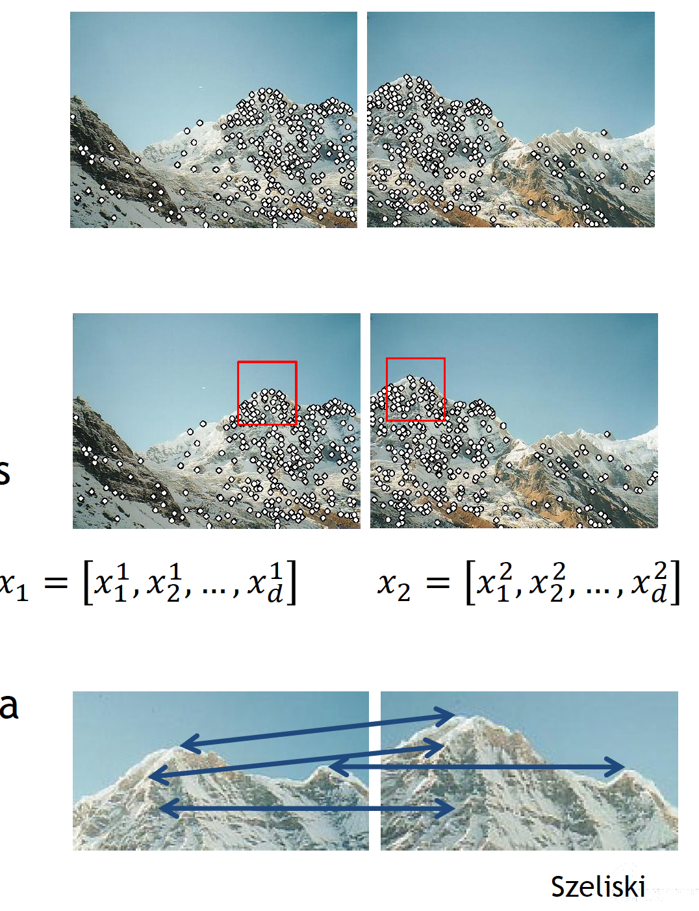
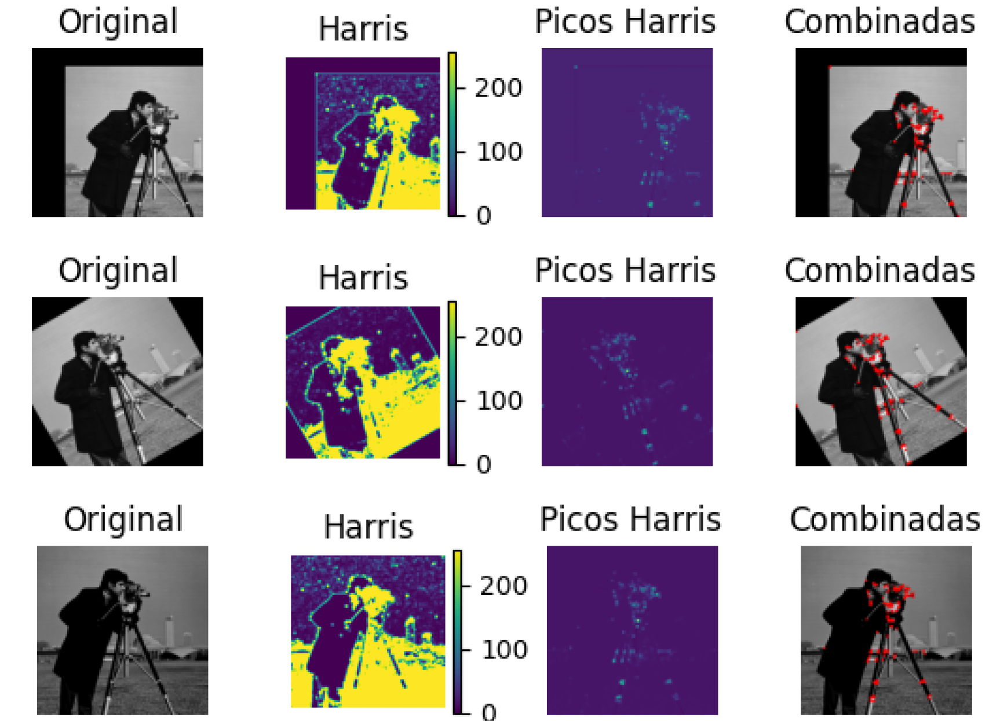
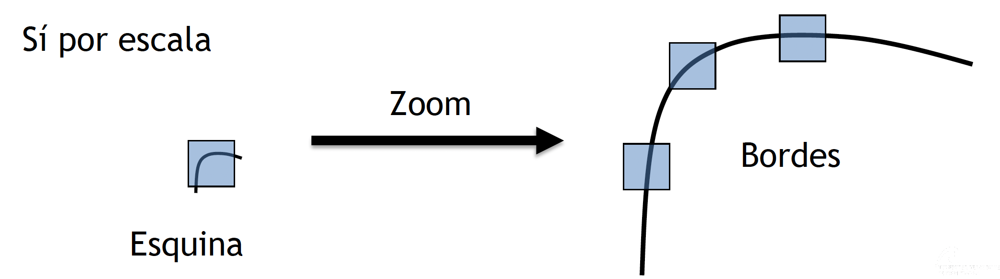

# Resumen de Puntos Clave para Evaluación - Visión por Computador

- [Resumen de Puntos Clave para Evaluación - Visión por Computador](#resumen-de-puntos-clave-para-evaluación---visión-por-computador)
  - [Introducción](#introducción)
  - [1. Detección de Puntos de Interés](#1-detección-de-puntos-de-interés)
    - [Definición](#definición)
      - [Alineamiento de imágenes](#alineamiento-de-imágenes)
    - [Propiedades Deseables](#propiedades-deseables)
    - [Métodos Destacados](#métodos-destacados)
      - [Detección. **Detector de Harris (1988)**](#detección-detector-de-harris-1988)
      - [Descripción. **SIFT (Scale-Invariant Feature Transform)**](#descripción-sift-scale-invariant-feature-transform)
      - [Encaje](#encaje)
  - [2. Detección de Bordes](#2-detección-de-bordes)
    - [Definición](#definición-1)
    - [Métodos Comunes](#métodos-comunes)
  - [3. Detección de Líneas](#3-detección-de-líneas)
    - [Transformada de Hough](#transformada-de-hough)
  - [4. Segmentación](#4-segmentación)
    - [Definición](#definición-2)
    - [Técnicas](#técnicas)
  - [5. Encaje (Matching)](#5-encaje-matching)
    - [Proceso](#proceso)
    - [Eliminación de Outliers](#eliminación-de-outliers)
  - [6. Evaluación de Resultados](#6-evaluación-de-resultados)
    - [Matriz de Confusión](#matriz-de-confusión)
    - [Métricas Derivadas](#métricas-derivadas)
  - [Herramientas Útiles en OpenCV](#herramientas-útiles-en-opencv)

## Introducción


La **detección de características** es un componente fundamental en Visión por Computador, ya que permite extraer información relevante de las imágenes para diversas aplicaciones como alineamiento de imágenes, reconocimiento de patrones, seguimiento de objetos y estabilización de video.

Las **características principales** que se detectan en imágenes incluyen:

- **Puntos de interés**
- **Esquinas**
- **Líneas**
- **Contornos**
- **Parches**

**Proceso**

Etapas:

- **Detección**: Identificación de puntos de interés.
- **Descripción**: Caracterizar puntos de interés. Generación de descriptores para cada punto.
- **Encaje**: Determinar la correspondencia.



---

## 1. Detección de Puntos de Interés

### Definición

Los **puntos de interés** son ubicaciones en una imagen donde ocurre un **cambio notable en el entorno de un píxel**, como esquinas, bordes y extremos. Son cruciales para tareas como el emparejamiento de imágenes y el seguimiento de objetos.


Presencia de elementos singulares/característicos en una imagen:

- extremos
- cambios de dirección


#### Alineamiento de imágenes

- Calibración de cámara
- Encaje estéreo
- Reconocimiento de patrones
- _Stitching_ de imágenes (mosaicos)
- Consulta de imágenes (_image retrieval_)
- Seguimiento
- Estabilización de vídeo (camaras, AR)

### Propiedades Deseables

- **Distintivos**: Deben ser únicos en su entorno para facilitar su identificación.
- **Repetibles**: Deben ser detectables en diferentes imágenes o condiciones.
- **Compactos**: Su representación debe ser eficiente en términos de almacenamiento y computación.
- **Eficientes**: Permitir una comparación rápida entre puntos para aplicaciones en tiempo real.

### Métodos Destacados

#### Detección. **Detector de Harris (1988)**

- **Descripción**: Identifica **esquinas** analizando variaciones en intensidad en dos direcciones perpendiculares.
- **Características**:

  - Calcula la matriz de autocorrelación de cada píxel.
  - <u>Es invariante a traslaciones, rotaciones y cambios en intensidad.</u>

  

  - **No es invariante a cambios de escala**.

  

- **Aplicación en OpenCV**:

  - Utilizar

  ```python
  gris = np.float32(gris) #Opera con 32 bits
  dst = cv2.cornerHarris(gris,2,3,0.04) #Calcula Harris
  dst = cv2.dilate(dst, None) #Dilata para resaltar
  cth=0.1
  rgb[dst>cth*dst.max()]=[255,0,0] #Remarca valores altos
  ```

  
  

  - Requiere una imagen en escala de grises y parámetros como el tamaño del bloque y el tamaño del kernel de Sobel.

#### Descripción. **SIFT (Scale-Invariant Feature Transform)**

- **Descripción**: Detecta y describe puntos de interés que son **invariantes a escala** y rotación.
- **Características**:

  - Utiliza diferencias de Gaussianas para detectar puntos clave.
  - Genera descriptores basados en histogramas de gradientes orientados.

  

  - Robusto a cambios de iluminación y pequeñas transformaciones afines.

- **Aplicación en OpenCV**:

  - Parte de puntos de interés (por ejemplo Harris o DoG).
  - Crear el objeto SIFT con

  ```python
  cv2.SIFT_create()
  ```

  - Detectar y computar con

  ```python
  sift = cv2.SIFT_create()
  kp = sift.detect(gris,None)
  imgkp=cv2.drawKeypoints(gris,kp,img)
  ```

  

En resumen:

- Gradiente, invarianza intensidad
- Orientación dominante en 16x16 para invarianza
- Discretiza orientaciones
- Textura depende de vista, histograma para invarianza
- Satura gradiente evitando brillos/destellos
- Múltiples escalas


#### Encaje

Decidir si dos puntos se corresponden:


(...)

**Evaluación (_scores_)**:


* **Verdadero positivo** (_TP true positive_): Encajes correctos
* **Falso negativo** (_FN false negative_): Encajes no detectados
* **Falso positivo** (_FP false positive_): Encajes incorrectos
* **Verdadero negativo** (_TN true negative_): No encajes bien rechazados

Matriz de confusión


A continuación se presentan las fórmulas matemáticas de las métricas más comunes utilizadas para evaluar modelos de clasificación binaria, junto con una descripción de cada concepto para facilitar su comprensión.

**Precisión**:

La precisión mide la proporción de verdaderos positivos entre todas las predicciones positivas realizadas por el modelo. Indica qué tan exactas son las predicciones positivas del modelo.


$$ \text{Precisión} = \frac{TP}{TP + FP} $$

* **TP** (True Positives): Número de verdaderos positivos.
* **FP** (False Positives): Número de falsos positivos.

**Recall** o **Sensibilidad**:

El recall o sensibilidad mide la proporción de verdaderos positivos entre todos los casos positivos reales. Indica la capacidad del modelo para detectar todas las instancias positivas.

$$ \text{Recall} = \text{Sensibilidad} = \frac{TP}{TP + FN} = \frac{TP}{P} $$

* **FN** (False Negatives): Número de falsos negativos.
* **P**: Número total de casos positivos reales (\( P = TP + FN \)).

**Tasa de Falsos Positivos** (_False Positive Rate_):

La tasa de falsos positivos mide la proporción de falsos positivos entre todos los casos negativos reales. Indica la probabilidad de que el modelo clasifique incorrectamente una instancia negativa como positiva.

$$ \text{FPR} = \frac{FP}{FP + TN} = \frac{FP}{N} $$

* **TN** (True Negatives): Número de verdaderos negativos.
* **N**: Número total de casos negativos reales (\( N = FP + TN \)).

**Exactitud** (_Accuracy_):

La exactitud mide la proporción de predicciones correctas (tanto positivas como negativas) sobre el total de predicciones realizadas. Es una medida general del rendimiento del modelo.

$$ \text{ACC} = \frac{TP + TN}{P + N} $$

**F1-Score**:

La puntuación F1 es la media armónica de la precisión y el recall. Es especialmente útil cuando hay un desequilibrio entre las clases, ya que busca un equilibrio entre la precisión y la sensibilidad del modelo.

$$ F1 = 2 \times \frac{\text{Precisión} \times \text{Recall}}{\text{Precisión} + \text{Recall}} $$

---

**Encaje o puntos SIFT en OpenCV**:

```python
sift = cv2.SIFT_create()
kp1,de1 = sift.detectAndCompute(gris1,None)
kp2,de2 = sift.detectAndCompute(gris2,None)
bf = cv2.BFMatcher(cv2.NORM_L2, crossCheck=True)
matches = bf.match(de1, de2)

# Ordenar orrespondencias por distancia
matches = sorted(matches, key=lambda x: x.distance)
img_matches= cv2.drawMatches(img1, kp1, img2, kp2, matches[:50], None, matchColor=(0, 0, 0),flags=cv2.DrawMatchesFlags_NOT_DRAW_SINGLE_POINTS)
```


**Encajes no coherentes, _outliers_**:

- **RANSAC** (_Random Sample Consensus_): Algoritmo robusto para estimar modelos a partir de datos con _outliers_.
  - Escoger par(es) de puntos aleatorios
  - Contar _inliers_ (puntos que cumplen modelo)
  - Repetir y escoger modelo con más _inliers_

Eliminar encajes erróneos (_outliers_):

```python
# Extrae los puntos de encaje
pts1 = np.float32([kp1[m.queryIdx].pt for m in matches]).reshape(-1, 1, 2)
pts2 = np.float32([kp2[m.trainIdx].pt for m in matches]).reshape(-1, 1, 2)
# RANSAC para filtrar outliers
H, mask = cv2.findHomography(pts1, pts2, cv2.RANSAC, 5.0)
matches_f = mask.ravel().tolist()
# Filtra correspondencias con RANSAC
matchesf = [matches[i] for i in range(len(matches)) if matches_mask[i]]
``` 

<ig src="img/sift_7.png" style="width: 100%">

1. **ORB (Oriented FAST and Rotated BRIEF)**

   - **Descripción**: Combina el detector FAST con el descriptor BRIEF, añadiendo invarianza a rotación y escala limitada.
   - **Características**:
     - Más rápido y eficiente que SIFT y SURF.
     - Utiliza descriptores binarios para comparaciones rápidas.
     - Ideal para aplicaciones en dispositivos móviles y tiempo real.
   - **Aplicación en OpenCV**:

     - Crear el objeto ORB con

     ```python
     cv2.ORB_create()
     ```

     - Detectar y computar con

     ```python
     orb.detectAndCompute()
     ```

---

## 2. Detección de Bordes

### Definición

Los bordes representan las fronteras entre regiones con diferencias significativas en intensidad o color. Son esenciales para entender la estructura y forma de los objetos en una imagen.

### Métodos Comunes

- **Gradiente (Sobel, Prewitt)**:

  - Calculan la primera derivada de la imagen para identificar cambios abruptos en intensidad.
  - **Operador Sobel**: Combina suavizado Gaussiano y diferenciación para reducir el ruido.

- **Laplaciana**:

  - Calcula la segunda derivada, resaltando áreas donde el cambio de gradiente es máximo.
  - Puede ser sensible al ruido; a menudo se combina con un suavizado previo.

- **Detector de Canny**:

  - **Pasos del Algoritmo**:
    1. **Suavizado Gaussiano**: Reduce el ruido y los detalles innecesarios.
    2. **Cálculo del Gradiente**: Utiliza operadores Sobel para encontrar la intensidad del gradiente y su dirección.
    3. **Supresión de No Máximos**: Afina los bordes eliminando píxeles que no son máximos locales.
    4. **Umbral con Histéresis**: Aplica dos umbrales para identificar bordes fuertes y débiles, conectándolos adecuadamente.
  - **Características**:
    - Produce bordes finos y bien definidos.
    - Minimiza la detección de falsos bordes.

---

## 3. Detección de Líneas

### Transformada de Hough

La transformada de Hough es una técnica para detectar formas geométricas, principalmente líneas, en una imagen.

- **Concepto Básico**:

  - Representa líneas mediante parámetros en el espacio polar: \( \rho = x \cos \theta + y \sin \theta \).
  - Cada punto en la imagen se traduce en una curva sinusoidal en el espacio de parámetros.
  - Las intersecciones de estas curvas indican la presencia de una línea.

- **Variantes**:
  - **Estándar (`cv2.HoughLines`)**:
    - Detecta líneas infinitas representadas por sus parámetros ρ y θ.
    - Requiere una imagen binarizada (por ejemplo, salida de Canny).
  - **Probabilística (`cv2.HoughLinesP`)**:
    - Detecta segmentos de línea en lugar de líneas completas.
    - Más eficiente en imágenes con muchas líneas.
    - Devuelve puntos de inicio y fin de cada segmento.

---

## 4. Segmentación

### Definición

La segmentación divide una imagen en regiones o objetos significativos, facilitando su análisis y comprensión.

### Técnicas

- **Watershed**:

  - Trata la imagen como una superficie topográfica.
  - Los píxeles con menor intensidad se consideran "valles" y los de mayor intensidad "crestas".
  - Se utiliza para separar objetos conectados.

- **Mean Shift**:

  - Algoritmo de clustering basado en densidad.
  - Mueve iterativamente cada píxel hacia la densidad máxima de píxeles similares.
  - No requiere especificar el número de clusters previamente.

- **SAM (Segment Anything Model)**:
  - Modelo avanzado basado en aprendizaje profundo.
  - Capaz de segmentar cualquier objeto en una imagen con una indicación mínima.
  - Utiliza una arquitectura de red neuronal pre-entrenada en una gran variedad de objetos.

---

## 5. Encaje (Matching)

### Proceso

1. **Detección de Puntos de Interés**:

   - Utilizar detectores como Harris, SIFT, ORB, etc.

2. **Descripción de Puntos**:

   - Generar descriptores que capturen la información local alrededor de cada punto.

3. **Comparación de Descriptores**:
   - Utilizar métricas de distancia para encontrar correspondencias entre descriptores.
   - **Distancia Euclídea**: Común para descriptores de SIFT.
   - **Distancia de Hamming**: Ideal para descriptores binarios como ORB.

### Eliminación de Outliers

- **RANSAC (Random Sample Consensus)**:
  - Algoritmo robusto para estimar modelos a partir de datos con outliers.
  - Iterativamente selecciona un subconjunto de datos para estimar el modelo y verifica su consistencia con el conjunto completo.
  - Utilizado para refinar correspondencias y calcular transformaciones como homografías.

---

## 6. Evaluación de Resultados

### Matriz de Confusión

Herramienta para evaluar el desempeño de un modelo de clasificación o detección.

- **TP (True Positive)**: Detecciones correctas.
- **FP (False Positive)**: Detecciones incorrectas (falsas alarmas).
- **FN (False Negative)**: Objetos no detectados.
- **TN (True Negative)**: Correctamente no detectados.

### Métricas Derivadas

- **Precisión (Precision)**:
  ```math
  \text{Precisión} = \frac{TP}{TP + FP}
  ```
  - Proporción de detecciones correctas sobre todas las detecciones.
- **Sensibilidad (Recall)**:

  ```math
  \text{Sensibilidad} = \frac{TP}{TP + FN}
  ```

  - Proporción de detecciones correctas sobre todos los objetos reales.

- **F1-Score**:

  - Media armónica de precisión y sensibilidad.
  - ```math
    F1 = 2 \times \frac{\text{Precisión} \times \text{Sensibilidad}}{\text{Precisión} + \text{Sensibilidad}}
    ```

  ```

  ```

---

## Herramientas Útiles en OpenCV

- **Detector de Esquinas de Harris**:

  ```python
  dst = cv2.cornerHarris(src_gray, blockSize, ksize, k)
  ```

  - `blockSize`: Tamaño del vecindario considerado.
  - `ksize`: Apertura del derivado de Sobel.
  - `k`: Parámetro libre en la ecuación de Harris.

- **SIFT**:

  ```python
  sift = cv2.SIFT_create()
  keypoints, descriptors = sift.detectAndCompute(gray, None)
  ```

- **ORB**:

  ```python
  orb = cv2.ORB_create()
  keypoints, descriptors = orb.detectAndCompute(gray, None)
  ```

- **Detector de Bordes de Canny**:

  ```python
  edges = cv2.Canny(image, threshold1, threshold2)
  ```

  - `threshold1` y `threshold2`: Umbrales para la histéresis.

- **Transformada de Hough para Líneas**:
  - Estándar:
    ```python
    lines = cv2.HoughLines(image, rho, theta, threshold)
    ```
  - Probabilística:
    ```python
    lines = cv2.HoughLinesP(image, rho, theta, threshold, minLineLength, maxLineGap)
    ```
