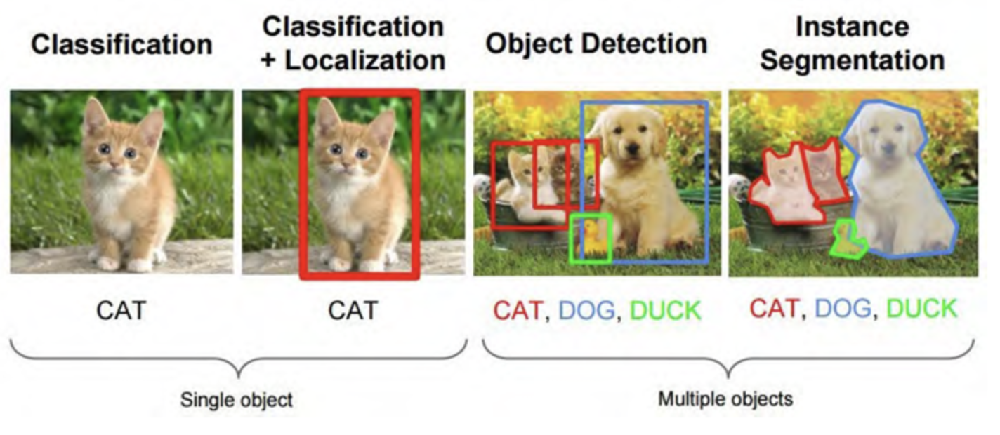
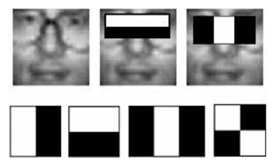

# Tema 5. Reconocimiento de Objetos

- [Tema 5. Reconocimiento de Objetos](#tema-5-reconocimiento-de-objetos)
  - [Introducción](#introducción)
  - [Detección](#detección)
    - [Enfoques previos a Deep Learning](#enfoques-previos-a-deep-learning)
      - [Viola y Jones (caras)](#viola-y-jones-caras)
      - [Dalal y Triggs (personas)](#dalal-y-triggs-personas)
    - [Comparación entre ambos enfoques](#comparación-entre-ambos-enfoques)
  - [Segmentación Semántica](#segmentación-semántica)
  - [Clasificación](#clasificación)
  - [Evaluación Experimental](#evaluación-experimental)
  - [Video](#video)
  - [Visión y lenguaje](#visión-y-lenguaje)
  - [Referencias](#referencias)

## Introducción

Tareas de la visión por computador:

* **Clasificación de Imagenes**: Dada una imagen, determinar la clase a la que pertenece.
  * ¿Es un gato? ¿qué clase de escena es esta?
* **Reconocimiento de ejmplar (_instance_)**: Dada una imagen, determinar la clase a la que pertenece y la localización de la instancia.
  * Busca a esta persona en la imagen.
  * Localiza este edificio.
* **Detección**: 
  * Localización de múltiples instancias de objetos en una imagen.
* **Comprensión de vídeo**: 
  * Detección de objetos en vídeo.
  * Seguimiento de objetos en vídeo.
  * Reconocimiento de acciones en vídeo.

**Proceso general**:

1. **Especificar modelo**
    * Estadístico
    * Articulado
    * Colección de ejemplares
    * Parametrizable

    > Modelo más complejo no necesariamente es mejor. + complejodad => + coste computacional.

2. **Generar hipótesis**
    * Ventana deslizante
    * Puntos de interés
    * Regiones
3. **Evaluar hipótesis** 
    * Confianza
    * Múltiples clasificadores

4. **Resolver detecciones**
   * Eliminación de no máximos (NMS)
   * Contexto
  

## Detección

Localizar el objeto en la imagen y clasificarlo.
Modelar el objeto

Comprobar multitud de ventanas/zonas y escalas
Selección de características
Medidas de encaje/similitud
Cambios de puntos de vista

**Retos**:

* Iluminación
* Pose
* Fondo
* Oclusiones: el objeto está parcialmente oculto
* Apariencia intraclase
* Punto de vista

### Enfoques previos a Deep Learning

Antes del auge de las redes neuronales profundas, los métodos clásicos para la detección de objetos se basaban en técnicas estadísticas y de ingeniería de características manuales. Estos enfoques empleaban características calculadas explícitamente y clasificadores convencionales para detectar y reconocer patrones en imágenes.

#### Viola y Jones (caras)

El método de Viola y Jones, desarrollado en 2001, fue uno de los primeros enfoques en tiempo real para la detección de caras. Este método se basa en tres componentes clave:

1. **Características Haar**: 
   - Se utilizan como **descriptores visuales** que representan patrones simples de luz y sombra en una imagen (e.g., bordes, líneas, regiones oscuras/claras).
   - Estas características son rápidas de calcular gracias al uso de imágenes integrales, lo que permite computar la suma de intensidades de píxeles en cualquier subregión de la imagen en tiempo constante.

2. **Boosting (AdaBoost)**:
   - Se emplea para combinar múltiples clasificadores débiles (como árboles de decisión) en un clasificador fuerte.
   - AdaBoost asigna pesos a los clasificadores débiles y a las muestras, enfocándose en aquellas que son más difíciles de clasificar.

3. **Clasificador en cascada**:
   - Organiza los clasificadores en etapas para filtrar rápidamente las regiones que probablemente no contengan un rostro.
   - Las ventanas pasan de una etapa a otra solo si son clasificadas como positivas, reduciendo así el coste computacional.

Este método marcó un hito debido a su capacidad para realizar detección en tiempo real, pero tiene limitaciones con caras que no estén bien alineadas o que sufran oclusiones.

#### Dalal y Triggs (personas)

El enfoque de Dalal y Triggs, introducido en 2005, está diseñado para detectar personas utilizando **Histogramas de Gradientes Orientados (HOG)** como características principales. Este método es especialmente efectivo para capturar formas y bordes de objetos.

1. **Características HOG**:
   - Dividen la imagen en celdas pequeñas (e.g., 8x8 píxeles).
   - Para cada celda, se calcula un histograma de gradientes orientados (dirección e intensidad de los cambios de color o brillo).
   - Los histogramas se normalizan en bloques superpuestos para hacerlos más robustos frente a cambios de iluminación o contraste.

2. **Clasificador SVM**:
   - Una **Máquina de Vectores de Soporte (SVM)** lineal se entrena para diferenciar entre personas y fondos.
   - El modelo SVM clasifica las ventanas deslizantes como positivas (persona) o negativas (fondo).

3. **Ventanas deslizantes**:
   - Se analiza toda la imagen dividiéndola en múltiples ventanas de diferentes escalas y posiciones, buscando patrones que coincidan con las características HOG.

Este enfoque es más robusto que Viola-Jones para objetos no alineados y para escenarios con mayor variabilidad en la apariencia de los objetos. Sin embargo, el coste computacional es elevado debido a la necesidad de examinar numerosas ventanas.

---

### Comparación entre ambos enfoques

| Método            | Características clave            | Clasificador        | Aplicación principal | Limitaciones                                   |
|-------------------|----------------------------------|---------------------|----------------------|-----------------------------------------------|
| **Viola y Jones** | Haar                             | Boosting en cascada | Detección de caras   | Sensible a oclusiones y cambios de pose       |
| **Dalal y Triggs**| HOG                              | SVM                 | Detección de personas| Computacionalmente costoso                    |

Ambos métodos fueron fundamentales en el desarrollo de la visión por computador y sentaron las bases para los enfoques modernos basados en Deep Learning.

## Segmentación Semántica

## Clasificación

## Evaluación Experimental

## Video

## Visión y lenguaje

## Referencias

* [Everything You Ever Wanted to Know About Computer Vision](https://towardsdatascience.com/everything-you-ever-wanted-to-know-about-computer-vision-heres-a-look-why-it-s-so-awesome-e8a58dfb641e)
