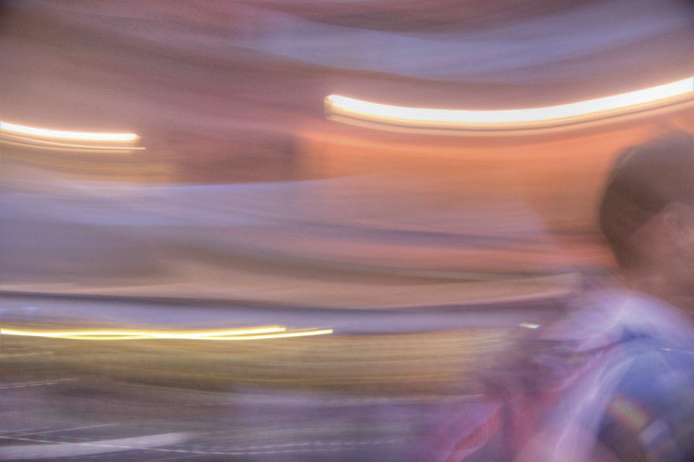
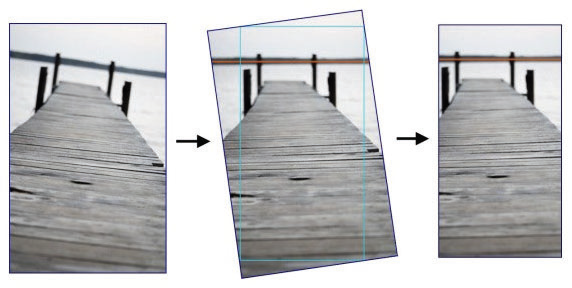
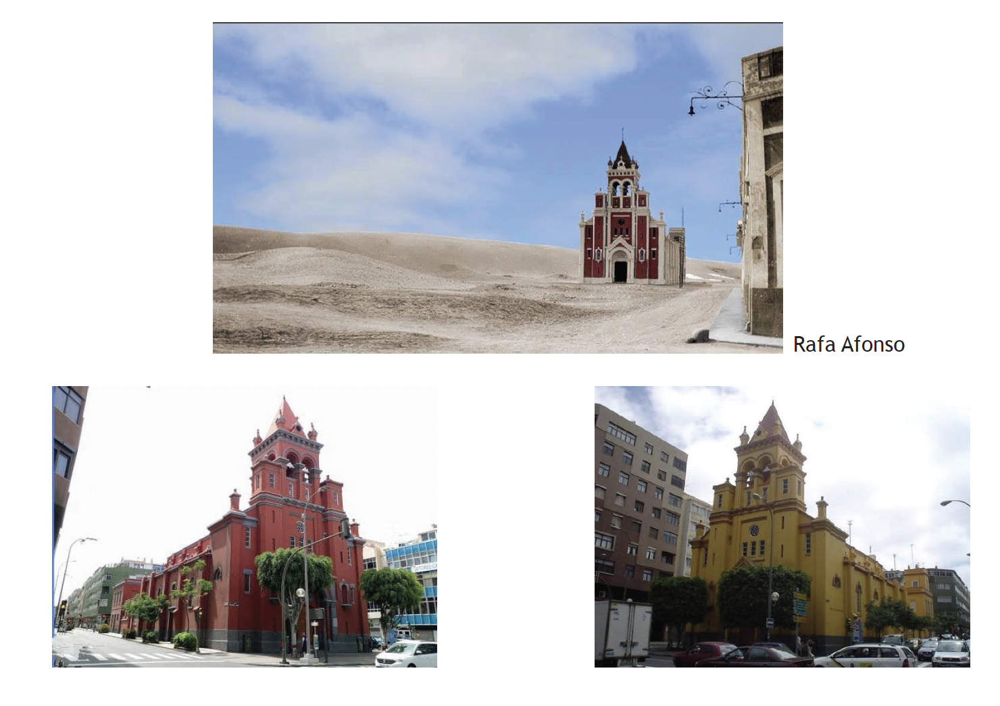
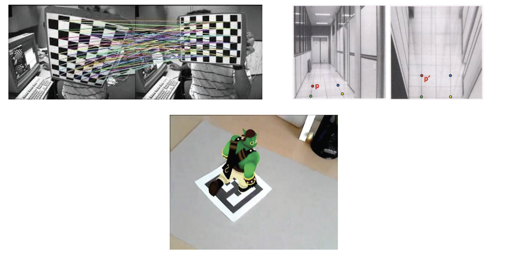
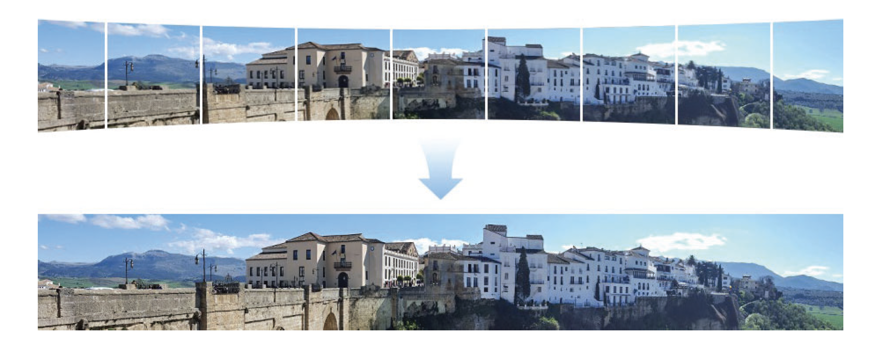
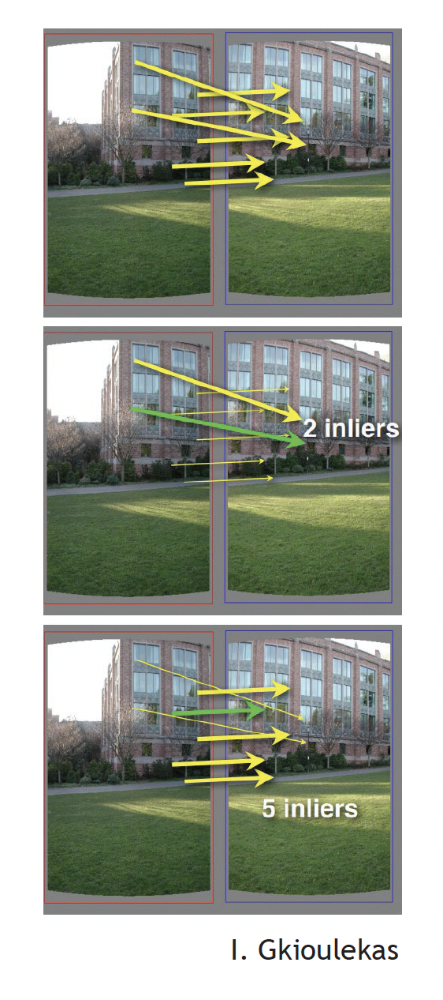
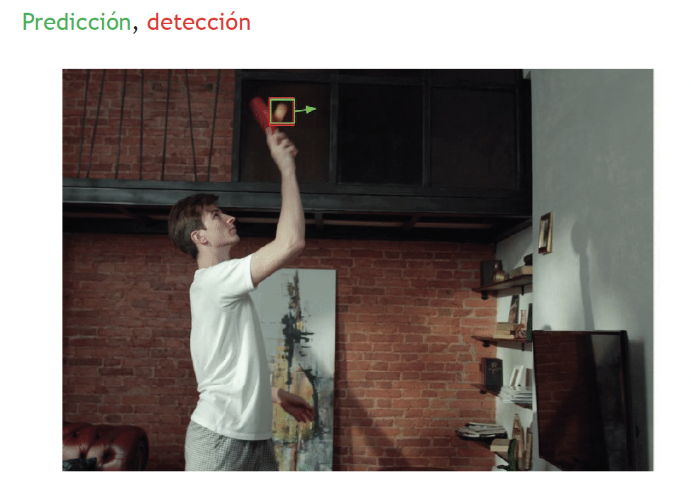
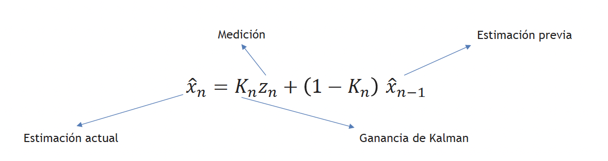
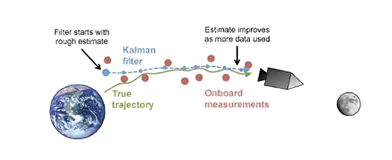

# Tema 7 - Movimiento en Visión por Computador



<div class="page"/>

## Índice

- [Tema 7 - Movimiento en Visión por Computador](#tema-7---movimiento-en-visión-por-computador)
  - [Índice](#índice)
  - [1. Introducción](#1-introducción)
    - [1.1 ¿Qué es el movimiento en visión por computador?](#11-qué-es-el-movimiento-en-visión-por-computador)
    - [1.2 Estimación del movimiento](#12-estimación-del-movimiento)
    - [1.3 Alineamiento de imágenes](#13-alineamiento-de-imágenes)
      - [1.3.1 Homografías](#131-homografías)
      - [RANSAC](#ransac)
      - [1.3.2 Estabilización de cámara](#132-estabilización-de-cámara)
    - [1.4 Movimiento como pista perceptiva](#14-movimiento-como-pista-perceptiva)
  - [2. Alineamiento Traslacional](#2-alineamiento-traslacional)
    - [2.1 Definición y métodos](#21-definición-y-métodos)
    - [2.2 Técnicas para minimizar errores](#22-técnicas-para-minimizar-errores)
      - [2.2.1 SSD (Sum of Squared Differences)](#221-ssd-sum-of-squared-differences)
      - [2.2.2 Correlación cruzada normalizada](#222-correlación-cruzada-normalizada)
    - [2.3 Estimación jerárquica y refinamiento](#23-estimación-jerárquica-y-refinamiento)
  - [3. Flujo Óptico](#3-flujo-óptico)
    - [3.1 Concepto y usos](#31-concepto-y-usos)
    - [3.2 Métodos principales](#32-métodos-principales)
      - [3.2.1 Lucas-Kanade](#321-lucas-kanade)
      - [3.2.2 Problemas del flujo óptico](#322-problemas-del-flujo-óptico)
    - [3.3 Segmentación basada en flujo óptico](#33-segmentación-basada-en-flujo-óptico)
    - [3.4 Aprendizaje en flujo óptico (FlowNet, RAFT)](#34-aprendizaje-en-flujo-óptico-flownet-raft)
  - [4. Seguimiento](#4-seguimiento)
    - [4.1 Introducción al seguimiento](#41-introducción-al-seguimiento)
      - [4.1.1 Detección basada en seguimiento](#411-detección-basada-en-seguimiento)
      - [4.1.2 Tipos de seguimiento (SOT, MOT)](#412-tipos-de-seguimiento-sot-mot)
    - [4.2 Métodos de seguimiento](#42-métodos-de-seguimiento)
      - [4.2.1 Puntos de interés](#421-puntos-de-interés)
      - [4.2.2 Sustracción de fondo](#422-sustracción-de-fondo)
      - [4.2.3 Modelos avanzados (DeepSORT, ByteTrack)](#423-modelos-avanzados-deepsort-bytetrack)
  - [5. Filtro de Kalman](#5-filtro-de-kalman)
    - [5.1 Principios básicos](#51-principios-básicos)
      - [Conceptos clave:](#conceptos-clave)
      - [Supuestos:](#supuestos)
    - [5.2 Uso en estimación dinámica](#52-uso-en-estimación-dinámica)
      - [5.2.1 Sistemas estáticos](#521-sistemas-estáticos)
      - [5.2.2 Sistemas dinámicos](#522-sistemas-dinámicos)
    - [5.3 Aplicaciones prácticas](#53-aplicaciones-prácticas)
      - [Ejemplos en visión por computador:](#ejemplos-en-visión-por-computador)
    - [Resumen](#resumen)

<div class="page"/>

## 1. Introducción

Contenidos:

* Introducción
* Traslacional
* Flujo óptico
* Seguimiento
* Filtro de Kalman

### 1.1 ¿Qué es el movimiento en visión por computador?

El movimiento en visión por computador se refiere al cambio de posición de los objetos en una secuencia de imágenes o video. Es clave para tareas como:
- Seguimiento de objetos.
- Reconocimiento de actividades.
- Estabilización de cámara.

### 1.2 Estimación del movimiento

Consiste en calcular el desplazamiento de píxeles, objetos o patrones entre dos imágenes consecutivas.



### 1.3 Alineamiento de imágenes



#### 1.3.1 Homografías



- Utilizadas para transformar imágenes y empalmarlas (**_image stitching_**).
- Ejemplo: Panoramas de fotografías.



#### RANSAC

RANSAC (_RANdom SAmple Consensus_) es un algoritmo robusto para estimar parámetros de modelos matemáticos. Se utiliza para eliminar valores atípicos (outliers) en la estimación de homografías.

Funcionamiento de RANSAC:

* Escoger par(es) de puntos aleatorios.
* Contar _inliers_ (puntos que cumplen con el modelo).
* Repetir hasta encontrar el mejor modelo.

Traslación con mator número de _inliers_. 
Repeticiones según número de muestras y probabilidad de _inliers_.



#### 1.3.2 Estabilización de cámara

- Suaviza movimientos de video mediante alineamiento de fotogramas consecutivos.

### 1.4 Movimiento como pista perceptiva

* A veces única pista disponible. 

<div class="page"/>

## 2. Alineamiento Traslacional

* Encaje más simple de dos imágenes. 
* Se busca la traslación que minimiza la diferencia entre ellas.
* Útil para seguimiento de objetos o corrección de movimiento de cámara. 

### 2.1 Definición y métodos
### 2.2 Técnicas para minimizar errores
#### 2.2.1 SSD (Sum of Squared Differences)
#### 2.2.2 Correlación cruzada normalizada
### 2.3 Estimación jerárquica y refinamiento

* Aplicar alineamiento con diferentes resoluciones (pirámide de imágenes).
* Afinar el resultado empezando por resolución baja y ajustando el model en resoluciones más finas. 

<div class="page"/>

## 3. Flujo Óptico
### 3.1 Concepto y usos
### 3.2 Métodos principales
#### 3.2.1 Lucas-Kanade
#### 3.2.2 Problemas del flujo óptico
### 3.3 Segmentación basada en flujo óptico
### 3.4 Aprendizaje en flujo óptico (FlowNet, RAFT)

<div class="page"/>

## 4. Seguimiento
### 4.1 Introducción al seguimiento
#### 4.1.1 Detección basada en seguimiento
#### 4.1.2 Tipos de seguimiento (SOT, MOT)
### 4.2 Métodos de seguimiento
#### 4.2.1 Puntos de interés
#### 4.2.2 Sustracción de fondo
#### 4.2.3 Modelos avanzados (DeepSORT, ByteTrack)

<div class="page"/>

## 5. Filtro de Kalman

### 5.1 Principios básicos
El filtro de Kalman es un algoritmo recursivo que estima el estado futuro de un sistema dinámico a partir de mediciones ruidosas y un modelo del sistema. Este se utiliza ampliamente en visión por computador y otras áreas debido a su capacidad para manejar incertidumbre en mediciones.



* Durante el seguimiento de objetos, el filtro de Kalman ayuda a predecir la posición futura de un objeto y corregir errores en mediciones.
* Se basa en dos pasos: predicción y corrección del estado del sistema.

Dadas estimación y medición, estima el estado futiro del objetivo. 
En seguimiento, medición proporcionada por la detección.



#### Conceptos clave:
- **Estado del sistema**: Representación de variables relevantes (e.g., posición, velocidad).
- **Predicción**: Proyección del estado futuro del sistema basada en el modelo dinámico.
- **Corrección**: Ajuste del estado predicho utilizando nuevas mediciones.
- **Ganancia de Kalman**: Determina cuánto se debe confiar en las mediciones frente al modelo predicho.

#### Supuestos:
1. El sistema tiene una dinámica lineal.
2. El ruido es blanco, aditivo y gaussiano.
3. Las mediciones pueden estar sujetas a errores.

**Ecuaciones principales**:
- **Predicción del estado**:
```
x_k' = A \cdot x_{k-1} + B \cdot u
```
- **Corrección del estado**:
```
x_k = x_k' + K \cdot (z_k - H \cdot x_k')
```
Donde \( x_k \) es el estado, \( z_k \) es la medición y \( K \) es la ganancia de Kalman.

---

### 5.2 Uso en estimación dinámica
El filtro de Kalman puede aplicarse en diferentes escenarios según la naturaleza del sistema que se quiera modelar.

#### 5.2.1 Sistemas estáticos
En sistemas donde no hay cambios significativos en el estado del sistema, el filtro se utiliza para reducir el impacto del ruido de medición.

**Ejemplo práctico**:
- Un radar detectando un avión en tierra. Aunque el avión no se mueve, las mediciones tienen errores debido a factores como ruido de sensores.

**Modelo estático**:
- **Estado constante**: \( x_k = x_{k-1} \)
- **Actualización basada en mediciones**:
```
x_k = x_{k-1} + K \cdot (z_k - x_{k-1})
```

---

#### 5.2.2 Sistemas dinámicos
En sistemas donde el estado cambia con el tiempo, como un coche en movimiento, el filtro utiliza un modelo dinámico que incorpora la velocidad y la aceleración.

**Ejemplo práctico**:
- Seguimiento de un coche con velocidad constante.
- Modelo dinámico: \( x_k = x_{k-1} + v \cdot t \), donde \( v \) es la velocidad.

**Predicción del estado**:
```
x_k' = x_{k-1} + v \cdot t
```

**Corrección del estado con mediciones**:
```
x_k = x_k' + K \cdot (z_k - x_k')
```

**Ganancia de Kalman ajusta la confianza**:
- Ganancia alta (\( K \approx 1 \)): Se confía más en la medición.
- Ganancia baja (\( K \approx 0 \)): Se confía más en la predicción previa.

**Ejemplo con OpenCV**:
```
python
import cv2
import numpy as np

# Configurar filtro de Kalman
kf = cv2.KalmanFilter(4, 2)  # 4 estados, 2 mediciones
kf.transitionMatrix = np.array([[1, 0, 1, 0],
                                [0, 1, 0, 1],
                                [0, 0, 1, 0],
                                [0, 0, 0, 1]], np.float32)
kf.measurementMatrix = np.eye(2, 4, dtype=np.float32)
kf.processNoiseCov = np.eye(4, dtype=np.float32) * 0.03

# Predicción y corrección
prediction = kf.predict()
measurement = np.array([x, y], dtype=np.float32)
corrected = kf.correct(measurement)

print("Predicción:", prediction)
print("Corrección:", corrected)
```

---

### 5.3 Aplicaciones prácticas
El filtro de Kalman es ampliamente utilizado en tareas donde es necesario estimar el estado de un sistema dinámico con alta precisión.

#### Ejemplos en visión por computador:
1. **Seguimiento de objetos**:
   - Rastrear personas o vehículos en videos.
   - Predecir su posición en el siguiente cuadro.

2. **Reconocimiento de gestos**:
   - Estimar el movimiento de manos, cabezas o labios.
   - Útil en interfaces hombre-máquina.

3. **Videovigilancia**:
   - Monitorizar personas u objetos en entornos dinámicos.

4. **Economía y predicción de datos**:
   - Filtrar ruido en datos financieros y predecir tendencias futuras.

5. **Navegación**:
   - Seguimiento de drones, vehículos autónomos y satélites.

**Ejemplo de aplicación**:
- Un dron en vuelo utiliza un filtro de Kalman para estimar su posición y velocidad basándose en mediciones ruidosas del GPS y acelerómetros. Esto permite un control más preciso del vuelo.

### Resumen

* Algoritmo que estima el estado del sistema
* Estima variables ocultas a partir de otras observables
* Maximiza probabilidad a posteriori
* Asume
  * Dinámica lineal
  * Ruido blanco, aditivo y gaussiano de las mediciones


