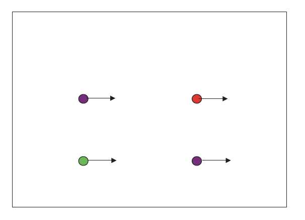
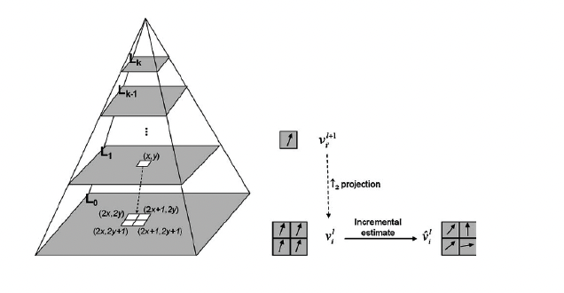

# Tema 7 - Movimiento en Visión por Computador


<div class="page"/>

## Índice

- [Tema 7 - Movimiento en Visión por Computador](#tema-7---movimiento-en-visión-por-computador)
  - [Índice](#índice)
  - [1. Introducción](#1-introducción)
    - [1.1 ¿Qué es el movimiento en visión por computador?](#11-qué-es-el-movimiento-en-visión-por-computador)
    - [1.2 Estimación del movimiento](#12-estimación-del-movimiento)
    - [1.3 Alineamiento de imágenes](#13-alineamiento-de-imágenes)
      - [1.3.1 Homografías](#131-homografías)
      - [RANSAC](#ransac)
      - [1.3.2 Estabilización de cámara](#132-estabilización-de-cámara)
    - [1.4 Movimiento como pista perceptiva](#14-movimiento-como-pista-perceptiva)
  - [2. Alineamiento Traslacional](#2-alineamiento-traslacional)
    - [Usos principales:](#usos-principales)
    - [2.1 Definición y métodos](#21-definición-y-métodos)
      - [Definición](#definición)
      - [Métodos básicos:](#métodos-básicos)
      - [Aplicaciones:](#aplicaciones)
    - [2.2 Técnicas para minimizar errores](#22-técnicas-para-minimizar-errores)
      - [2.2.1 SSD (Sum of Squared Differences)](#221-ssd-sum-of-squared-differences)
      - [2.2.2 Correlación cruzada normalizada](#222-correlación-cruzada-normalizada)
    - [2.3 Estimación jerárquica y refinamiento](#23-estimación-jerárquica-y-refinamiento)
      - [Proceso:](#proceso)
      - [Refinamiento:](#refinamiento)
    - [Resumen:](#resumen)
  - [3. Flujo Óptico](#3-flujo-óptico)
    - [3.1 Concepto y usos](#31-concepto-y-usos)
    - [3.2 Métodos principales](#32-métodos-principales)
      - [3.2.1 Lucas-Kanade](#321-lucas-kanade)
      - [3.2.2 Problemas del flujo óptico](#322-problemas-del-flujo-óptico)
    - [3.3 Segmentación basada en flujo óptico](#33-segmentación-basada-en-flujo-óptico)
    - [3.4 Aprendizaje en flujo óptico (FlowNet, RAFT)](#34-aprendizaje-en-flujo-óptico-flownet-raft)
  - [4. Seguimiento](#4-seguimiento)
    - [4.1 Introducción al seguimiento](#41-introducción-al-seguimiento)
      - [4.1.1 Detección basada en seguimiento](#411-detección-basada-en-seguimiento)
      - [4.1.2 Tipos de seguimiento (SOT, MOT)](#412-tipos-de-seguimiento-sot-mot)
    - [4.2 Métodos de seguimiento](#42-métodos-de-seguimiento)
      - [4.2.1 Puntos de interés](#421-puntos-de-interés)
      - [4.2.2 Sustracción de fondo](#422-sustracción-de-fondo)
      - [4.2.3 Modelos avanzados (DeepSORT, ByteTrack)](#423-modelos-avanzados-deepsort-bytetrack)
  - [5. Filtro de Kalman](#5-filtro-de-kalman)
    - [5.1 Principios básicos](#51-principios-básicos)
      - [Conceptos clave:](#conceptos-clave)
      - [Supuestos:](#supuestos)
    - [5.2 Uso en estimación dinámica](#52-uso-en-estimación-dinámica)
      - [5.2.1 Sistemas estáticos](#521-sistemas-estáticos)
      - [5.2.2 Sistemas dinámicos](#522-sistemas-dinámicos)
    - [5.3 Aplicaciones prácticas](#53-aplicaciones-prácticas)
      - [Ejemplos en visión por computador:](#ejemplos-en-visión-por-computador)
    - [Resumen](#resumen-1)

<div class="page"/>

## 1. Introducción

Contenidos:

* Introducción
* Traslacional
* Flujo óptico
* Seguimiento
* Filtro de Kalman

### 1.1 ¿Qué es el movimiento en visión por computador?

El movimiento en visión por computador se refiere al cambio de posición de los objetos en una secuencia de imágenes o video. Es clave para tareas como:
- Seguimiento de objetos.
- Reconocimiento de actividades.
- Estabilización de cámara.

### 1.2 Estimación del movimiento

Consiste en calcular el desplazamiento de píxeles, objetos o patrones entre dos imágenes consecutivas.


### 1.3 Alineamiento de imágenes


#### 1.3.1 Homografías


- Utilizadas para transformar imágenes y empalmarlas (**_image stitching_**).
- Ejemplo: Panoramas de fotografías.


#### RANSAC

RANSAC (_RANdom SAmple Consensus_) es un algoritmo robusto para estimar parámetros de modelos matemáticos. Se utiliza para eliminar valores atípicos (outliers) en la estimación de homografías.

Funcionamiento de RANSAC:

* Escoger par(es) de puntos aleatorios.
* Contar _inliers_ (puntos que cumplen con el modelo).
* Repetir hasta encontrar el mejor modelo.

Traslación con mator número de _inliers_. 
Repeticiones según número de muestras y probabilidad de _inliers_.


#### 1.3.2 Estabilización de cámara

- Suaviza movimientos de video mediante alineamiento de fotogramas consecutivos.

### 1.4 Movimiento como pista perceptiva

* A veces única pista disponible. 

<div class="page"/>

## 2. Alineamiento Traslacional

El alineamiento traslacional es el método más simple para alinear dos imágenes, considerando solo desplazamientos horizontales y verticales. Su objetivo principal es encontrar la traslación que minimice la diferencia entre las dos imágenes.



### Usos principales:
1. **Seguimiento de objetos**: Detectar y seguir el movimiento de un objeto en secuencias de imágenes.
2. **Corrección de movimiento de cámara**: Compensar movimientos indeseados en videos.

---

### 2.1 Definición y métodos
#### Definición
El alineamiento traslacional se basa en mover una imagen sobre otra para que coincidan de la mejor manera posible. Esto implica calcular un desplazamiento \( (u, v) \) que minimice la diferencia entre las intensidades de los píxeles correspondientes.

#### Métodos básicos:
1. **Búsqueda exhaustiva**: Probar todos los posibles desplazamientos dentro de un rango definido.
2. **Optimización jerárquica**: Utilizar diferentes niveles de resolución para aproximar la solución más rápidamente.

#### Aplicaciones:
- Estabilización de cámara en videos.
- Creación de panoramas al empalmar imágenes.
- Seguimiento básico de objetos en imágenes consecutivas.

**Ejemplo práctico con OpenCV (búsqueda exhaustiva)**:

```python
import cv2
import numpy as np

# Cargar imágenes
img1 = cv2.imread("img1.jpg", 0)  # Imagen de referencia
img2 = cv2.imread("img2.jpg", 0)  # Imagen a alinear

# Búsqueda exhaustiva en un rango de desplazamiento
best_score = float('inf')
best_u, best_v = 0, 0

for u in range(-10, 10):  # Rango horizontal
    for v in range(-10, 10):  # Rango vertical
        shifted = np.roll(img2, (u, v), axis=(0, 1))
        score = np.sum((img1 - shifted) ** 2)  # SSD
        if score < best_score:
            best_score = score
            best_u, best_v = u, v

print(f"Mejor desplazamiento: ({best_u}, {best_v})")
```

---

### 2.2 Técnicas para minimizar errores
#### 2.2.1 SSD (Sum of Squared Differences)
El **SSD** mide la **diferencia entre dos imágenes sumando los cuadrados de las diferencias de intensidades de píxeles**. Es uno de los métodos más comunes para comparar imágenes.

**Ventajas**:
- Sencillo de implementar.
- Bueno para imágenes con iluminación constante.

**Fórmula**:
```
SSD = \sum_{i,j} \left[ I_1(i,j) - I_2(i+u, j+v) \right]^2
```

Donde \( I_1 \) e \( I_2 \) son las intensidades de las imágenes y \( (u, v) \) es el desplazamiento.

**Limitaciones**:
- Sensible a cambios de iluminación.
- No maneja bien las partes fuera de los límites de las imágenes.

#### 2.2.2 Correlación cruzada normalizada
La correlación cruzada evalúa la similitud entre dos regiones, siendo más robusta frente a cambios de brillo o contraste. Su versión normalizada la escala en el rango [-1, 1].

**Fórmula**:
```
NCC = \frac{\sum_{i,j} \left[ (I_1(i,j) - \mu_1) \cdot (I_2(i+u, j+v) - \mu_2) \right]}
{\sqrt{\sum_{i,j} (I_1(i,j) - \mu_1)^2 \cdot \sum_{i,j} (I_2(i+u, j+v) - \mu_2)^2}}
```

Donde \( \mu_1 \) y \( \mu_2 \) son las medias de las intensidades de las imágenes.

**Ventajas**:
- Insensible a cambios globales de brillo.
- Adecuada para aplicaciones con iluminación variable.

**Ejemplo práctico con OpenCV (correlación cruzada)**:

```python
import cv2
import numpy as np

# Cargar imágenes
img1 = cv2.imread("img1.jpg", 0)
img2 = cv2.imread("img2.jpg", 0)

# Calcular correlación cruzada
result = cv2.matchTemplate(img2, img1, method=cv2.TM_CCOEFF_NORMED)
_, max_val, _, max_loc = cv2.minMaxLoc(result)

print(f"Mejor correlación: {max_val} en posición {max_loc}")
```

---

### 2.3 Estimación jerárquica y refinamiento
En problemas de alineamiento de imágenes, una aproximación jerárquica mejora la eficiencia al trabajar con diferentes resoluciones (pirámides de imágenes).



#### Proceso:
1. **Reducción de resolución**: Crear versiones reducidas de las imágenes.
2. **Alineamiento en baja resolución**: Calcular el desplazamiento inicial en la resolución más baja.
3. **Refinamiento progresivo**: Usar la estimación obtenida como punto de partida en resoluciones más altas.

**Ventajas**:
- Más rápido que la búsqueda exhaustiva a alta resolución.
- Proporciona una aproximación inicial precisa.

#### Refinamiento:
Después de alinear las imágenes hasta el píxel más cercano, se puede afinar el desplazamiento buscando en subpíxeles mediante interpolación.

**Ejemplo práctico con OpenCV (jerárquico)**:

```python
import cv2
import numpy as np

# Cargar imágenes
img1 = cv2.imread("img1.jpg", 0)
img2 = cv2.imread("img2.jpg", 0)

# Calcular alineamiento usando ECC (Enhanced Correlation Coefficient)
warp_matrix = np.eye(2, 3, dtype=np.float32)
criteria = (cv2.TERM_CRITERIA_EPS | cv2.TERM_CRITERIA_COUNT, 50, 1e-6)
_, warp_matrix = cv2.findTransformECC(img1, img2, warp_matrix, cv2.MOTION_TRANSLATION, criteria)

print("Matriz de transformación jerárquica:\n", warp_matrix)
```

---

### Resumen:
1. **Alineamiento traslacional** es el método más simple para alinear imágenes desplazándolas horizontal o verticalmente.
2. **Técnicas comunes**:
   - SSD: Suma de diferencias cuadradas.
   - NCC: Correlación cruzada normalizada.
3. **Estimación jerárquica** acelera el alineamiento inicial y mejora la precisión mediante refinamiento.

Con este conocimiento, puedes abordar preguntas relacionadas con el alineamiento traslacional y su implementación práctica en OpenCV.

<div class="page"/>

## 3. Flujo Óptico
### 3.1 Concepto y usos
### 3.2 Métodos principales
#### 3.2.1 Lucas-Kanade
#### 3.2.2 Problemas del flujo óptico
### 3.3 Segmentación basada en flujo óptico
### 3.4 Aprendizaje en flujo óptico (FlowNet, RAFT)

<div class="page"/>

## 4. Seguimiento
### 4.1 Introducción al seguimiento
#### 4.1.1 Detección basada en seguimiento
#### 4.1.2 Tipos de seguimiento (SOT, MOT)
### 4.2 Métodos de seguimiento
#### 4.2.1 Puntos de interés
#### 4.2.2 Sustracción de fondo
#### 4.2.3 Modelos avanzados (DeepSORT, ByteTrack)

<div class="page"/>

## 5. Filtro de Kalman

### 5.1 Principios básicos
El filtro de Kalman es un algoritmo recursivo que estima el estado futuro de un sistema dinámico a partir de mediciones ruidosas y un modelo del sistema. Este se utiliza ampliamente en visión por computador y otras áreas debido a su capacidad para manejar incertidumbre en mediciones.


* Durante el seguimiento de objetos, el filtro de Kalman ayuda a predecir la posición futura de un objeto y corregir errores en mediciones.
* Se basa en dos pasos: predicción y corrección del estado del sistema.

Dadas estimación y medición, estima el estado futiro del objetivo. 
En seguimiento, medición proporcionada por la detección.


#### Conceptos clave:
- **Estado del sistema**: Representación de variables relevantes (e.g., posición, velocidad).
- **Predicción**: Proyección del estado futuro del sistema basada en el modelo dinámico.
- **Corrección**: Ajuste del estado predicho utilizando nuevas mediciones.
- **Ganancia de Kalman**: Determina cuánto se debe confiar en las mediciones frente al modelo predicho.

#### Supuestos:
1. El sistema tiene una dinámica lineal.
2. El ruido es blanco, aditivo y gaussiano.
3. Las mediciones pueden estar sujetas a errores.

**Ecuaciones principales**:
- **Predicción del estado**:
```
x_k' = A \cdot x_{k-1} + B \cdot u
```
- **Corrección del estado**:
```
x_k = x_k' + K \cdot (z_k - H \cdot x_k')
```
Donde \( x_k \) es el estado, \( z_k \) es la medición y \( K \) es la ganancia de Kalman.

---

### 5.2 Uso en estimación dinámica
El filtro de Kalman puede aplicarse en diferentes escenarios según la naturaleza del sistema que se quiera modelar.

#### 5.2.1 Sistemas estáticos
En sistemas donde no hay cambios significativos en el estado del sistema, el filtro se utiliza para reducir el impacto del ruido de medición.

**Ejemplo práctico**:
- Un radar detectando un avión en tierra. Aunque el avión no se mueve, las mediciones tienen errores debido a factores como ruido de sensores.

**Modelo estático**:
- **Estado constante**: \( x_k = x_{k-1} \)
- **Actualización basada en mediciones**:
```
x_k = x_{k-1} + K \cdot (z_k - x_{k-1})
```

---

#### 5.2.2 Sistemas dinámicos
En sistemas donde el estado cambia con el tiempo, como un coche en movimiento, el filtro utiliza un modelo dinámico que incorpora la velocidad y la aceleración.

**Ejemplo práctico**:
- Seguimiento de un coche con velocidad constante.
- Modelo dinámico: \( x_k = x_{k-1} + v \cdot t \), donde \( v \) es la velocidad.

**Predicción del estado**:
```
x_k' = x_{k-1} + v \cdot t
```

**Corrección del estado con mediciones**:
```
x_k = x_k' + K \cdot (z_k - x_k')
```

**Ganancia de Kalman ajusta la confianza**:
- Ganancia alta (\( K \approx 1 \)): Se confía más en la medición.
- Ganancia baja (\( K \approx 0 \)): Se confía más en la predicción previa.

**Ejemplo con OpenCV**:

```python
import cv2
import numpy as np

# Configurar filtro de Kalman
kf = cv2.KalmanFilter(4, 2)  # 4 estados, 2 mediciones
kf.transitionMatrix = np.array([[1, 0, 1, 0],
                                [0, 1, 0, 1],
                                [0, 0, 1, 0],
                                [0, 0, 0, 1]], np.float32)
kf.measurementMatrix = np.eye(2, 4, dtype=np.float32)
kf.processNoiseCov = np.eye(4, dtype=np.float32) * 0.03

# Predicción y corrección
prediction = kf.predict()
measurement = np.array([x, y], dtype=np.float32)
corrected = kf.correct(measurement)

print("Predicción:", prediction)
print("Corrección:", corrected)
```

---

### 5.3 Aplicaciones prácticas
El filtro de Kalman es ampliamente utilizado en tareas donde es necesario estimar el estado de un sistema dinámico con alta precisión.

#### Ejemplos en visión por computador:
1. **Seguimiento de objetos**:
   - Rastrear personas o vehículos en videos.
   - Predecir su posición en el siguiente cuadro.

2. **Reconocimiento de gestos**:
   - Estimar el movimiento de manos, cabezas o labios.
   - Útil en interfaces hombre-máquina.

3. **Videovigilancia**:
   - Monitorizar personas u objetos en entornos dinámicos.

4. **Economía y predicción de datos**:
   - Filtrar ruido en datos financieros y predecir tendencias futuras.

5. **Navegación**:
   - Seguimiento de drones, vehículos autónomos y satélites.

**Ejemplo de aplicación**:
- Un dron en vuelo utiliza un filtro de Kalman para estimar su posición y velocidad basándose en mediciones ruidosas del GPS y acelerómetros. Esto permite un control más preciso del vuelo.

### Resumen

* Algoritmo que estima el estado del sistema
* Estima variables ocultas a partir de otras observables
* Maximiza probabilidad a posteriori
* Asume
  * Dinámica lineal
  * Ruido blanco, aditivo y gaussiano de las mediciones


