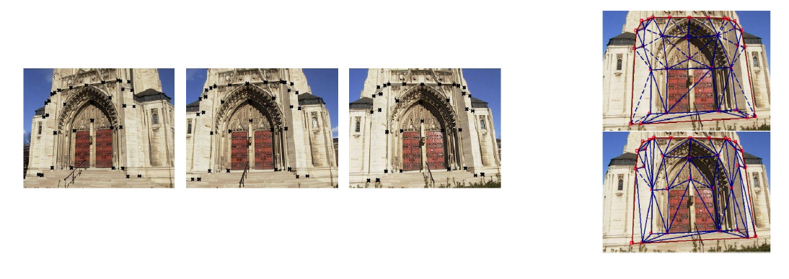

# Tema 8 - Geometría, Estructura y Forma


## Índice

- [Tema 8 - Geometría, Estructura y Forma](#tema-8---geometría-estructura-y-forma)
  - [Índice](#índice)
  - [1. Introducción](#1-introducción)
    - [1.1 Aplicaciones de la geometría y estructura en visión por computador](#11-aplicaciones-de-la-geometría-y-estructura-en-visión-por-computador)
  - [2. Calibración geométrica](#2-calibración-geométrica)
    - [2.1 Perspectiva](#21-perspectiva)
      - [Proyección de coordenadas al plano imagen](#proyección-de-coordenadas-al-plano-imagen)
    - [2.2 Transformaciones homogéneas](#22-transformaciones-homogéneas)
      - [Matriz de transformación mundo-cámara](#matriz-de-transformación-mundo-cámara)
      - [Matriz de proyección](#matriz-de-proyección)
      - [Matriz de transformación cámara-píxeles](#matriz-de-transformación-cámara-píxeles)
    - [2.3 Parámetros intrínsecos y extrínsecos](#23-parámetros-intrínsecos-y-extrínsecos)
      - [Parámetros intrínsecos](#parámetros-intrínsecos)
      - [Parámetros extrínsecos](#parámetros-extrínsecos)
        - [Homografía](#homografía)
  - [3. Metrología](#3-metrología)
    - [3.1 Estimación de información 3D](#31-estimación-de-información-3d)
      - [Perspectiva y puntos de fuga](#perspectiva-y-puntos-de-fuga)
      - [Razón anarmónica o _cross-ratio_](#razón-anarmónica-o-cross-ratio)
    - [3.2 Métodos para medir alturas](#32-métodos-para-medir-alturas)
      - [Relación con puntos de fuga y coordenadas](#relación-con-puntos-de-fuga-y-coordenadas)
    - [Puntos de funga](#puntos-de-funga)
    - [3.3 Profundidad monocular](#33-profundidad-monocular)
      - [Métodos supervisados](#métodos-supervisados)
      - [Métodos no supervisados](#métodos-no-supervisados)
  - [4. Geometría Epipolar](#4-geometría-epipolar)
    - [4.1 Conceptos básicos](#41-conceptos-básicos)
      - [Epipolos, líneas y planos epipolares](#epipolos-líneas-y-planos-epipolares)
      - [Restricción epipolar](#restricción-epipolar)
    - [4.2 Matrices esenciales y fundamentales](#42-matrices-esenciales-y-fundamentales)
      - [Matriz esencial ((E)):](#matriz-esencial-e)
      - [Matriz fundamental ((F)):](#matriz-fundamental-f)
      - [Estimación en OpenCV](#estimación-en-opencv)
  - [5. Correspondencia](#5-correspondencia)
    - [Estéreo](#estéreo)
    - [5.1 Coincidencia de puntos en imágenes](#51-coincidencia-de-puntos-en-imágenes)
      - [Algoritmos de encaje y rectificación](#algoritmos-de-encaje-y-rectificación)
    - [5.2 Triangulación](#52-triangulación)
      - [Recuperación de profundidad a partir de disparidad](#recuperación-de-profundidad-a-partir-de-disparidad)
    - [5.3 Métodos densos](#53-métodos-densos)
      - [Problemas y soluciones con mapas de disparidad](#problemas-y-soluciones-con-mapas-de-disparidad)
  - [6. Estructura desde movimiento (SfM)](#6-estructura-desde-movimiento-sfm)
    - [6.1 Proceso para recuperar la estructura 3D](#61-proceso-para-recuperar-la-estructura-3d)
      - [Detección de puntos clave](#detección-de-puntos-clave)
      - [Estimación de movimiento y estructura](#estimación-de-movimiento-y-estructura)
      - [Refinamiento mediante RANSAC y filtros](#refinamiento-mediante-ransac-y-filtros)
  - [7. Reconstrucción 3D](#7-reconstrucción-3d)
    - [Función Plenóptica](#función-plenóptica)
    - [7.1 Métodos modernos](#71-métodos-modernos)
      - [Radiance Fields (NeRFs)](#radiance-fields-nerfs)
      - [Gaussian Splatting](#gaussian-splatting)
    - [7.2 Casos de uso](#72-casos-de-uso)
      - [Generación de escenas 3D](#generación-de-escenas-3d)
      - [Modelado de entornos dinámicos](#modelado-de-entornos-dinámicos)
  - [8. Casos prácticos y tecnologías relacionadas](#8-casos-prácticos-y-tecnologías-relacionadas)
    - [Realidad aumentada y calibración](#realidad-aumentada-y-calibración)
    - [SLAM (Simultaneous Localization and Mapping)](#slam-simultaneous-localization-and-mapping)
    - [Usos en automoción y robótica](#usos-en-automoción-y-robótica)
  - [9. Conclusión](#9-conclusión)
    - [Resumen de los conceptos clave](#resumen-de-los-conceptos-clave)
    - [Importancia y aplicaciones futuras](#importancia-y-aplicaciones-futuras)
  - [Bibliografía y recursos](#bibliografía-y-recursos)
    - [Referencias clave](#referencias-clave)
  - [10. Glosario](#10-glosario)

## 1. Introducción

**Contenidos**

- Calibración geométrica
- Metrología
- Geometría epipolar
- Correspondencia
- Estructura desde movimiento (SfM)
- Reconstrucción 3D

> **Nota sobre notación y álgebra**: Estas secciones asumen familiaridad básica con álgebra lineal y matrices de transformación. Se recomienda repasar conceptos de vectores, rotaciones y traslaciones antes de profundizar en geometría de la visión.

> **Cómo encajan todos los conceptos**: Gran parte de la visión por computador combina calibración (para conocer la cámara), homografías (para planificar transformaciones o medir en un plano), y la geometría epipolar (para recuperar estructura 3D). Más adelante, estas técnicas se enriquecen con métodos de reconstrucción avanzados (NeRFs o Gaussian Splatting), sumando robustez con algoritmos como RANSAC o SLAM, lo cual posibilita aplicaciones complejas como realidad aumentada, conducción autónoma o robótica.

### 1.1 Aplicaciones de la geometría y estructura en visión por computador

La geometría y estructura desempeñan un papel fundamental en la visión por computador, ya que permiten analizar las relaciones espaciales entre objetos y la cámara.

**Aplicaciones comunes:**

- **Calibración de cámaras:** Determinar las características intrínsecas y extrínsecas de una cámara para realizar mediciones precisas.
- **Reconstrucción 3D:** Usar múltiples vistas de una escena para generar modelos tridimensionales.
- **Seguimiento de objetos:** Analizar el movimiento de objetos en una secuencia de imágenes.
- **Realidad aumentada:** Integrar elementos virtuales en escenas reales mediante un entendimiento geométrico del entorno.
- **Automoción:** Determinar posiciones 3D de vehículos y peatones para conducción autónoma.

---

## 2. Calibración geométrica

### 2.1 Perspectiva

#### Proyección de coordenadas al plano imagen

La **perspectiva** es el proceso por el cual un punto tridimensional en el espacio es proyectado en un plano bidimensional (imagen) mediante una cámara.


- **Proyección de un punto 3D (X, Y, Z):**
  Para proyectar un punto 3D al plano imagen (x, y), se utiliza una **matriz de proyección**. La relación se puede expresar como:

  ```math
  x = \frac{fX}{Z}, \quad y = \frac{fY}{Z}
  ```

  Donde:

  - \(f\): distancia focal de la cámara.
  - \(Z\): profundidad del punto en el espacio.

- **Coordenadas homogéneas:**
  En visión por computador, las coordenadas homogéneas se utilizan para representar puntos en el espacio y simplificar transformaciones geométricas. Un punto 3D \((X, Y, Z)\) se representa como:

  ```math
  \mathbf{X_h} = (X, Y, Z, 1)^T
  ```

  Al proyectarlo al plano imagen, se obtiene:

  ```math
  \mathbf{x_h} = P \cdot \mathbf{X_h}
  ```

  Donde \(P\) es la matriz de proyección.

  

---

### 2.2 Transformaciones homogéneas

#### Matriz de transformación mundo-cámara

Esta matriz describe cómo transformar puntos desde el sistema de coordenadas del mundo al sistema de coordenadas de la cámara.

- **Estructura de la matriz:**

  ```math
  \mathbf{T} =
  \begin{bmatrix}
  R & t \\
  0 & 1
  \end{bmatrix}
  ```

  Donde:

  - \(R\): matriz de rotación (3x3), define la orientación de la cámara respecto al mundo.
  - \(t\): vector de traslación (3x1), define la posición de la cámara en el mundo.
  - \(\mathbf{T}\): matriz de transformación homogénea (4x4).

#### Matriz de proyección

La matriz de proyección relaciona puntos en coordenadas del mundo con puntos en el plano imagen. Es una combinación de matrices intrínsecas y extrínsecas:

```math
P = K \cdot [R|t]
```

- \(K\): matriz de parámetros intrínsecos.
- \([R|t]\): transformación mundo-cámara (extrínsecos).

#### Matriz de transformación cámara-píxeles

Convierte las coordenadas de la cámara en coordenadas del plano imagen, incluyendo la escala en píxeles:

```math
K =
\begin{bmatrix}
f_x & 0 & c_x \\
0 & f_y & c_y \\
0 & 0 & 1
\end{bmatrix}
```

Donde:

- \(f_x, f_y\): escala focal en píxeles (relacionada con la distancia focal física).
- \(c_x, c_y\): coordenadas del centro óptico de la cámara en píxeles.

---

### 2.3 Parámetros intrínsecos y extrínsecos

#### Parámetros intrínsecos

Los parámetros intrínsecos describen las **características internas de la cámara**.

- Punto principal
- Focal
- Escalado
- Píxeles no rectangulares
- Distorsión radial


- **Punto principal:** Intersección del eje óptico con el plano imagen (\(c_x, c_y\)).

  - Intersección eje principal con plano imagen.
  - Origen en coordenadas de la cámara, \p=(p_x, p_y)\.
  - Coordenadas de la image, origen esquina superior izquierda, \o=(o_x, o_y)\.
  - Suele asumirse el centro de la imagen, \c=(c_x, c_y)\.

  

- **Factor de Escala:** Relación entre el tamaño físico y los píxeles (\(f_x, f_y\)).

  - Mapeo del mundo a unidades de píxeles \m=(m_x, m_y)\. Píxeles por metro.

  

- **Distorsión radial:** Deformaciones causadas por lentes no ideales.

#### Parámetros extrínsecos

Los parámetros extrínsecos describen la posición y orientación de la cámara en el espacio.

- **Rotación:** Define cómo la cámara está orientada en el espacio.
- **Traslación:** Representa la posición de la cámara respecto al sistema de referencia global.

**Relación entre intrínsecos y extrínsecos:**
La proyección de un punto 3D al plano imagen utiliza tanto parámetros intrínsecos como extrínsecos:

```math
\mathbf{x} \sim K[R|t] \mathbf{X}
```

Donde:

- \(\mathbf{X}\): punto en el espacio 3D.
- \(\mathbf{x}\): punto proyectado en la imagen.
- \(K[R|t]\): combinación de intrínsecos y extrínsecos para formar la matriz de proyección completa.

##### Homografía

La homografía es una transformación proyectiva que mapea puntos de una imagen a otra vista de la misma escena.

- Relaciona puntos sobre un plano en dos imágenes
- Matrix 3x3, nueve valores, pero 8 incógnitas
- Necesarios al menos 4 puntos en ambas imágenes
- Cada par, dos ecuaciones


> **Ejemplo adicional**: Al alinear imágenes de un libro plano fotografiado desde diferentes ángulos, se define una homografía para corregir la perspectiva y superponer las páginas en una misma superficie 2D.

---

## 3. Metrología

- Estimar información 3D a partir de imágenes 2D
- Perspectiva y puntos de fuga
- Objetos de referencia y mediciones


### 3.1 Estimación de información 3D

#### Perspectiva y puntos de fuga

- **Definición:**
  La **perspectiva** proyecta el espacio tridimensional (3D) al plano bidimensional (2D). Los **puntos de fuga** son intersecciones donde líneas paralelas convergen en la imagen.

- **Uso práctico:**

  - Determinar propiedades geométricas de objetos como dimensiones o distancias.
  - Ejemplo: En edificios, las líneas convergen hacia puntos de fuga que permiten calcular alturas.

- **Cálculo de puntos de fuga:**
  1. Detectar bordes con Canny.
  2. Detectar líneas con la Transformada de Hough.
  3. Encontrar intersecciones de líneas para identificar los puntos de fuga.

```python
import cv2
import numpy as np

# Detectar bordes y líneas
imagen = cv2.imread("edificio.jpg")
gris = cv2.cvtColor(imagen, cv2.COLOR_BGR2GRAY)
bordes = cv2.Canny(gris, 50, 150)
lineas = cv2.HoughLines(bordes, 1, np.pi/180, 200)

# Procesar intersecciones de líneas
# Código adicional aquí según implementación específica
```

#### Razón anarmónica o _cross-ratio_

- **Definición:**
  Invariante geométrica que permite medir proporciones relativas entre puntos proyectados en imágenes.

- **Fórmula:**

  ```math
  CR(A, B, C, D) = \frac{(C - A)(D - B)}{(C - B)(D - A)}
  ```

  - Si \(D\) está en el infinito:

    ```math
    CR(A, B, C, \infty) = \frac{C - A}{C - B}
    ```

    

- **Aplicaciones:**
  - Calcular proporciones y dimensiones en imágenes proyectadas.
  - Mantener coherencia geométrica en transformaciones.

---

### 3.2 Métodos para medir alturas

#### Relación con puntos de fuga y coordenadas

- **Proceso:**
  1. Identificar el punto base y la cima del objeto en la imagen.
  2. Trazar líneas hacia los puntos de fuga.
  3. Usar la razón anarmónica para calcular la altura relativa.

```python
# Código básico para procesar líneas proyectadas
punto_base = (x1, y1)
punto_cima = (x2, y2)
# Calcular relación entre base y cima (ejemplo conceptual)
```

### Puntos de funga

- Objetos artificiales como edificios, etc.
- Intersectar líneas 2D que se corresponden a paralelas
- Obtención de puntos de fuga
- Aproximación focal
- Permite estimar medidas y distancias


**Fórmula**:


---

### 3.3 Profundidad monocular

- A partir de una imagen. Diversas pistas:

  - Intensidad (_shading_)
  - Perspectiva
  - Tamaño relativo
  - Tamaño conocido
  - Atenuación atmosférica
  - Oclusión
  - Gradientes de textura

#### Métodos supervisados

- **Definición:**
  Utilizan datasets etiquetados para predecir mapas de profundidad.

- **Ejemplos:**
  - Sensores RGB-D (e.g., Kinect).
  - Modelos como Monodepth2.


#### Métodos no supervisados

- **Definición:**
  Basados en pistas visuales como sombras, gradientes de textura y tamaño relativo.

- **Ejemplo:**
  - Gradientes de textura: Texturas más densas indican mayor profundidad.
  - Tamaño relativo: Objetos más pequeños suelen estar más alejados.

---

## 4. Geometría Epipolar

Dos cámaras, una escena, dos imágenes.


### 4.1 Conceptos básicos

#### Epipolos, líneas y planos epipolares

- **Epipolo:** Punto de intersección entre la línea que une los centros de las cámaras y el plano imagen.
- **Línea epipolar:** Línea en la segunda imagen donde se encuentra la proyección de un punto de la primera imagen.
- **Plano epipolar:** Plano formado por el punto 3D y los centros de las cámaras.


#### Restricción epipolar

- **Definición:**
  Un punto proyectado en una cámara debe encontrarse en la línea epipolar de la otra cámara.

- **Ecuación:**
  ```math
  \mathbf{x'}^\top \mathbf{F} \mathbf{x} = 0
  ```
  Donde:
  - \(\mathbf{F}\): Matriz fundamental.


---

### 4.2 Matrices esenciales y fundamentales

#### Matriz esencial (\(E\)):

- **Uso:**
  Relaciona puntos en coordenadas normalizadas para cámaras calibradas.
- **Propiedades:**
  - Rango 2.
  - 5 grados de libertad.

#### Matriz fundamental (\(F\)):

- **Uso:**
  Relaciona puntos en coordenadas de píxeles para cámaras no calibradas.
- **Propiedades:**
  - Rango 2.
  - 7 grados de libertad.

#### Estimación en OpenCV

- **Estimación de \(F\):**

  ```python
  import cv2
  F, mask = cv2.findFundamentalMat(points1, points2, cv2.FM_LMEDS)
  ```

- **Estimación de \(E\):**

  ```python
  import cv2
  E, mask = cv2.findEssentialMat(points1, points2, K)
  ```

## 5. Correspondencia

### Estéreo

La **visión estéreo** utiliza dos cámaras para obtener diferentes vistas de una misma escena. Esto permite estimar la profundidad de los objetos mediante la triangulación y la disparidad entre las imágenes.


- **Par estéreo rectificado:** Las imágenes deben estar alineadas para que las líneas epipolares sean horizontales. Esto facilita la búsqueda de correspondencias entre píxeles de ambas imágenes.


---

### 5.1 Coincidencia de puntos en imágenes

#### Algoritmos de encaje y rectificación

- **Encaje de puntos:**

  - Identifica puntos clave en una imagen y busca sus correspondencias en otra.
  - Algoritmos comunes:
    - **ORB (Oriented FAST and Rotated BRIEF):** Detecta puntos clave y los describe para encontrar coincidencias.
    - **SIFT/AKAZE:** Detectores robustos para encontrar correspondencias incluso con cambios de escala o iluminación.
  - Ejemplo con OpenCV:

  ```python
  import cv2

  # Detectar puntos clave y calcular descriptores
  sift = cv2.SIFT_create()
  kp1, des1 = sift.detectAndCompute(img1, None)
  kp2, des2 = sift.detectAndCompute(img2, None)

  # Coincidir descriptores con FLANN
  index_params = dict(algorithm=1, trees=5)
  search_params = dict(checks=50)
  flann = cv2.FlannBasedMatcher(index_params, search_params)
  matches = flann.knnMatch(des1, des2, k=2)

  # Filtrar buenas coincidencias
  good_matches = [m for m, n in matches if m.distance < 0.7 * n.distance]
  ```

- **Rectificación estéreo:**
  - Proceso de alinear imágenes para que las líneas epipolares sean horizontales.
  - Mejora la eficiencia en la búsqueda de correspondencias.
  ```python
  # Rectificación de imágenes
  h1, w1 = img1.shape[:2]
  h2, w2 = img2.shape[:2]
  rectify_scale = 1  # Escala completa
  rect_l, rect_r, proj_l, proj_r, Q, roi_l, roi_r = cv2.stereoRectify(
      K1, d1, K2, d2, (w1, h1), R, T, alpha=rectify_scale
  )
  ```

---

### 5.2 Triangulación

#### Recuperación de profundidad a partir de disparidad

- **Definición:**
  - La triangulación utiliza las posiciones de un punto en ambas imágenes (coordenadas 2D) y la geometría de las cámaras para calcular su posición 3D.
- **Ecuación básica:**

  ```math
  Z = \frac{f \cdot B}{d}
  ```

  Donde:

  - \(Z\): Profundidad.
  - \(f\): Distancia focal.
  - \(B\): Base estéreo (distancia entre cámaras).
  - \(d\): Disparidad (diferencia en posición del punto entre las imágenes).

- **Implementación en OpenCV:**

  ```python
  # Calcular disparidad
  stereo = cv2.StereoBM_create(numDisparities=16, blockSize=15)
  disparity = stereo.compute(imgL, imgR)

  # Triangulación
  points_3D = cv2.reprojectImageTo3D(disparity, Q)
  ```

---

### 5.3 Métodos densos

#### Problemas y soluciones con mapas de disparidad

- **Problemas comunes:**
  - **Oclusiones:** Regiones visibles en una cámara pero no en la otra.
  - **Zonas sin textura:** Superficies lisas dificultan la detección de correspondencias.
  - **Ruido:** Errores en el cálculo de disparidad debido a correspondencias incorrectas.
- **Soluciones:**
  - Aplicar **filtros de suavizado** para reducir el ruido.
  - Utilizar técnicas de aprendizaje profundo para estimar mapas de disparidad más precisos.

---

## 6. Estructura desde movimiento (SfM)


### 6.1 Proceso para recuperar la estructura 3D

La **estructura desde movimiento (SfM)** permite recuperar la geometría 3D de una escena y el movimiento de la cámara usando múltiples imágenes.

#### Detección de puntos clave

- **Objetivo:**
  Identificar puntos de interés robustos en cada imagen para rastrearlos entre múltiples vistas.
- **Proceso**:
  - Detección de buenos puntos
  - Correspondencia entre imágenes (LK, correlación, etc.)
  - Estimación de movimiento y estructura 3D
  - Refinamiento mediante RANSAC y filtros
  - Ajuse fino y reconstrucción 3D
- **Ejemplo:**

  ```python
  import cv2

  # Detectar puntos clave con ORB
  orb = cv2.ORB_create()
  kp1, des1 = orb.detectAndCompute(img1, None)
  kp2, des2 = orb.detectAndCompute(img2, None)

  # Encontrar correspondencias
  bf = cv2.BFMatcher(cv2.NORM_HAMMING, crossCheck=True)
  matches = bf.match(des1, des2)
  ```

  

#### Estimación de movimiento y estructura

- **Estimación del movimiento:**
  Utiliza correspondencias entre puntos clave para calcular la matriz de movimiento de la cámara (matrices de rotación \(R\) y traslación \(t\)).
- **Estimación de estructura:**
  Triangula puntos clave en múltiples vistas para obtener sus coordenadas 3D.

  ```python
  # Calcular matriz esencial y movimiento
  E, mask = cv2.findEssentialMat(points1, points2, K)
  _, R, t, mask = cv2.recoverPose(E, points1, points2, K)

  # Triangulación
  points_3D = cv2.triangulatePoints(proj1, proj2, points1.T, points2.T)
  ```

#### Refinamiento mediante RANSAC y filtros

**RANSAC** (_RANdom SAmple Consensus_) es un algoritmo robusto para estimar parámetros de modelos a partir de un conjunto de datos con outliers.


- **RANSAC (Random Sample Consensus):**
  - Identifica correspondencias confiables eliminando puntos atípicos (outliers).
  ```python
  # Aplicar RANSAC para limpiar correspondencias
  E, mask = cv2.findEssentialMat(points1, points2, K, method=cv2.RANSAC, prob=0.99, threshold=1.0)
  ```
- **Filtros adicionales:**
  - Suavizar reconstrucciones 3D para eliminar irregularidades.
  - Usar técnicas de ajuste fino para minimizar errores.

> **Relación con RANSAC**: Este algoritmo sólido detecta outliers y mejora la exactitud en la estimación de parámetros (por ejemplo, para la línea del horizonte o puntos de fuga), elevando la fiabilidad de medidas en entornos con ruido.

## 7. Reconstrucción 3D

### Función Plenóptica

- **Definición:**
  La función plenóptica describe la cantidad de luz que llega a un punto en el espacio desde todas las direcciones posibles.


Si conociéramos la función plenóptica, podríamos reconstruir una escena 3D completa con detalles precisos desde cualquier perspectiva, por ejemplo: radiance fields, gaussian splatting.

### 7.1 Métodos modernos

**Radiance field** (campo de radiancia/resplandor): escena como nube de partículas con distinta transparencia. Reproducción volumétrica, con densidad como transparencia.

**Neural Radiance Fields (NeRFs)**: modela L con una red neuronal. Irrupción aprendizaje profundo en visión por computador.

#### Radiance Fields (NeRFs)

- **Definición:**
  Los **Radiance Fields**, comúnmente conocidos como NeRFs, son una técnica basada en redes neuronales que permite reconstruir una escena tridimensional utilizando imágenes bidimensionales capturadas desde distintas perspectivas. La idea principal es modelar la radiancia (intensidad y color de la luz) que emana de cada punto en el espacio en función de su posición y dirección de observación.

- **Funcionamiento:**

  1. La red neuronal se entrena para mapear las coordenadas espaciales \((x, y, z)\) y los ángulos de visión \((\theta, \phi)\) a un color y densidad.
  2. Usando un algoritmo de renderizado basado en rayos, se generan imágenes desde cualquier perspectiva deseada.
  3. Este proceso es computacionalmente intensivo pero produce resultados muy detallados y realistas.

- **Aplicaciones:**
  - Generación de escenarios 3D detallados para cine, videojuegos y realidad virtual.
  - Reconstrucción de objetos para digitalización cultural o arqueología.
- **Ventajas:**
  - Captura detalles complejos como reflejos, sombras y texturas.
  - Permite reconstrucciones detalladas con un número limitado de imágenes.

Ejemplo visual: Un NeRF podría reconstruir una escena interior de una habitación completa desde solo unas pocas fotos.

> **Ejemplo adicional**: Con un conjunto de imágenes fijas de un objeto pequeño (una estatua), NeRF puede recrear vistas completamente diferentes incluso con iluminación sofisticada, ayudando a museos a documentar piezas históricas.

#### Gaussian Splatting

- **Definición:**
  _**Gaussian Splatting**_ es una técnica que representa una escena tridimensional utilizando una nube de puntos enriquecida con distribuciones gaussianas. Cada punto no solo tiene una posición 3D, sino también información sobre color, transparencia y densidad.

- **Funcionamiento:**
  - Los puntos en la escena se modelan como esferas gaussianas con parámetros específicos.
  - La técnica discretiza la escena, permitiendo renderizar vistas con menos costo computacional que los NeRFs.
- **Comparación con NeRFs:**
  - Gaussian Splatting es más rápido, lo que lo hace adecuado para aplicaciones en tiempo real.
  - NeRFs tienen mayor fidelidad en escenas complejas.

---

### 7.2 Casos de uso

#### Generación de escenas 3D

- **Definición:**
  Reconstruir entornos tridimensionales a partir de imágenes 2D para visualización o análisis.
- **Aplicaciones:**
  - Turismo virtual: Crear modelos 3D de monumentos históricos.
  - Educación: Simular entornos geográficos o científicos.
- **Ejemplo práctico:**
  - Usando NeRFs, es posible reconstruir una plaza histórica completa, incluidas texturas y sombras.

#### Modelado de entornos dinámicos

- **Definición:**
  Crear modelos tridimensionales de escenarios que cambian en tiempo real, como el tráfico urbano o eventos deportivos.
- **Ejemplo:**
  - En un cruce de tráfico, cámaras múltiples generan un modelo dinámico donde se ven todos los vehículos y peatones moviéndose en tiempo real.
- **Relevancia:**
  Este tipo de modelado es esencial para la conducción autónoma y los sistemas de vigilancia avanzados.

---

## 8. Casos prácticos y tecnologías relacionadas

### Realidad aumentada y calibración

- **Realidad aumentada (AR):**
  La AR combina elementos virtuales con el mundo físico, superponiéndolos en tiempo real. Para que esto sea posible, se necesita una calibración precisa de la cámara para alinear correctamente los elementos virtuales con el entorno físico.
- **Calibración:**
  - Implica determinar las propiedades intrínsecas y extrínsecas de la cámara:
    - Intrínsecas: Distancia focal, punto principal, coeficientes de distorsión.
    - Extrínsecas: Posición y orientación de la cámara en el espacio.
- **Ejemplo práctico con OpenCV:**

  ```python
  import cv2
  import numpy as np

  # Patrón de calibración (tablero de ajedrez)
  obj_points = []  # Coordenadas 3D del patrón
  img_points = []  # Coordenadas 2D detectadas en la imagen

  # Calibrar cámara
  ret, mtx, dist, rvecs, tvecs = cv2.calibrateCamera(obj_points, img_points, (w, h), None, None)

  # Aplicar realidad aumentada
  img = cv2.imread("imagen_real.jpg")
  cv2.drawFrameAxes(img, mtx, dist, rvecs[0], tvecs[0], length=5)
  ```

### SLAM (Simultaneous Localization and Mapping)

- **Definición:**
  SLAM es una técnica que permite a un dispositivo, como un robot o un vehículo, mapear su entorno mientras calcula simultáneamente su propia posición dentro de ese entorno.
- **Proceso:**
  1. Captura de datos sensoriales (cámaras, LIDAR, etc.).
  2. Identificación de características clave en el entorno.
  3. Creación de un mapa 3D mientras se rastrea la posición del dispositivo.
- **Aplicaciones:**
  - Vehículos autónomos para navegación precisa.
  - Drones para exploración y mapeo.
- **Herramientas comunes:**
  - ROS (Robot Operating System) para integración de SLAM.
  - ORB-SLAM2, una implementación robusta basada en puntos clave.

### Usos en automoción y robótica

- **Automoción:**
  - Reconstrucción del entorno para vehículos autónomos.
  - Análisis en tiempo real de tráfico y obstáculos.
- **Robótica:**
  - Interacción con humanos en entornos dinámicos.
  - Robots de exploración para mapeo de entornos desconocidos.

---

## 9. Conclusión

### Resumen de los conceptos clave

- **Reconstrucción 3D:**
  - Las técnicas modernas como NeRFs y Gaussian Splatting han revolucionado la forma de representar y analizar entornos tridimensionales.
  - Métodos como la triangulación y la correspondencia de puntos siguen siendo fundamentales para muchas aplicaciones.
- **Casos prácticos:**
  - Desde la realidad aumentada hasta SLAM, estas tecnologías tienen un impacto directo en la forma en que interactuamos con el mundo.

### Importancia y aplicaciones futuras

- **Impacto actual:**
  - Las técnicas de visión por computador son pilares para tecnologías avanzadas como la conducción autónoma, la realidad aumentada y la robótica.
- **Futuro:**
  - Modelado 3D más rápido y preciso gracias a técnicas como Gaussian Splatting.
  - Interacciones más naturales entre humanos y máquinas mediante reconstrucción en tiempo real.
  - Exploración espacial y mapeo planetario utilizando SLAM avanzado.

## Bibliografía y recursos

### Referencias clave

- R.Szeliski.ComputerVision:AlgorithmsandApplications,2nded.2022
- A.Torralbaetal.FoundationsofComputerVision,2024
- R.Hartley,A.Zisserman.MultipleViewGeometryinComputerVision,2nded.2004

## 10. Glosario

**Homografía:** Transformación proyectiva que relaciona puntos de dos vistas de un mismo plano a través de una matriz 3×3.  
**Punto principal:** Intersección del eje óptico con el plano imagen; a menudo cerca del centro de la imagen.  
**Razón anarmónica (cross-ratio):** Invariante geométrico que mide la relación entre cuatro puntos alineados.  
**Neural Radiance Fields (NeRFs):** Redes neuronales que modelan la radiancia de escenas para generar vistas 3D con gran realismo.  
**Gaussian Splatting:** Método de representación de escenas 3D mediante nubes de puntos con distribuciones gaussianas, útil para renderizado rápido.  
**Restricción epipolar:** Condición que impone que el punto correspondiente en la segunda imagen se halle sobre la línea epipolar.  
**SLAM:** Conjunto de métodos para estimar simultáneamente la localización de un dispositivo y construir un mapa de su entorno.  
**Función plenóptica:** Representa toda la luz disponible en cada punto y en todas las direcciones de un espacio.  
**Matriz esencial:** Relaciona puntos entre dos imágenes de cámaras calibradas en coordenadas normalizadas.  
**Matriz fundamental:** Relaciona puntos en coordenadas de píxeles para cámaras no calibradas.  
**RANSAC:** Algoritmo robusto para estimar parámetros de un modelo ignorando datos atípicos.  
**Rectificación estéreo:** Procedimiento para alinear dos imágenes de un par estéreo, facilitando la búsqueda de disparidades.  
**Disparidad:** Diferencia de posición de un punto en dos imágenes estéreo; permite calcular la profundidad.  
**Puntos de fuga:** Intersecciones en la imagen de líneas paralelas en el espacio que convergen según la perspectiva.  
**Transformada de Hough:** Herramienta para detectar formas geométricas (líneas, círculos) en una imagen.  
**Factor de escala:** Relación entre el tamaño físico de un objeto y su representación en píxeles.
