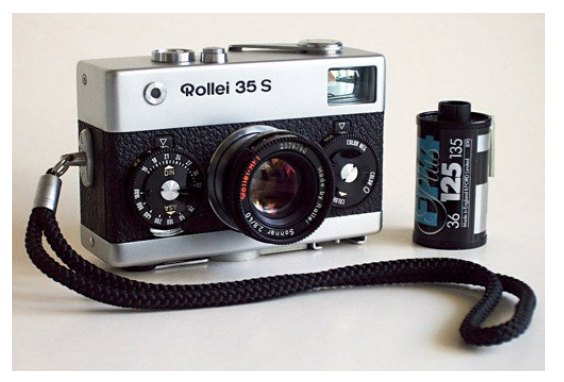

# Tema 9 - **Introducción a la Fotografía Computacional**


> **Objetivo**: Comprender los conceptos fundamentales de la fotografía computacional, sus principales aplicaciones, metodologías y los avances recientes que permiten a las cámaras digitales (incluyendo smartphones) superar las limitaciones de la fotografía tradicional.

---

## Índice

- [Tema 9 - **Introducción a la Fotografía Computacional**](#tema-9---introducción-a-la-fotografía-computacional)
  - [Índice](#índice)
  - [1. Introducción](#1-introducción)
    - [1.1 ¿Qué es la fotografía computacional?](#11-qué-es-la-fotografía-computacional)
    - [1.2 Historia y evolución](#12-historia-y-evolución)
    - [1.3 Comparación: Cámaras tradicionales vs. cámaras digitales modernas](#13-comparación-cámaras-tradicionales-vs-cámaras-digitales-modernas)
    - [1.4 Aplicaciones comerciales y científicas](#14-aplicaciones-comerciales-y-científicas)
  - [2. Rango Dinámico (HDR)](#2-rango-dinámico-hdr)
    - [2.1 Definición y conceptos clave](#21-definición-y-conceptos-clave)
    - [2.2 Limitaciones del rango dinámico en cámaras tradicionales](#22-limitaciones-del-rango-dinámico-en-cámaras-tradicionales)
    - [2.3 Procesos de generación de imágenes HDR](#23-procesos-de-generación-de-imágenes-hdr)
      - [2.3.1 Multi-exposición y combinación de imágenes](#231-multi-exposición-y-combinación-de-imágenes)
      - [2.3.2 Mapeo tonal](#232-mapeo-tonal)
    - [2.4 Ejemplos y herramientas: OpenCV y métodos como Debevec](#24-ejemplos-y-herramientas-opencv-y-métodos-como-debevec)
  - [3. Mateado de Imágenes (Image Matting)](#3-mateado-de-imágenes-image-matting)
    - [3.1 Definición y aplicaciones](#31-definición-y-aplicaciones)
    - [3.2 Técnicas de mateado](#32-técnicas-de-mateado)
      - [3.2.1 Mateado con pantalla azul/verde](#321-mateado-con-pantalla-azulverde)
      - [3.2.2 Mateado natural](#322-mateado-natural)
      - [3.2.3 Mateado en materiales traslúcidos](#323-mateado-en-materiales-traslúcidos)
    - [3.3 Algoritmos modernos y aprendizaje profundo](#33-algoritmos-modernos-y-aprendizaje-profundo)
  - [4. Texturas en Visión por Computador](#4-texturas-en-visión-por-computador)
    - [4.1 ¿Qué es una textura?](#41-qué-es-una-textura)
      - [4.1.1 Homogeneidad y repetición](#411-homogeneidad-y-repetición)
      - [4.1.2 Propiedades estructurales y estadísticas](#412-propiedades-estructurales-y-estadísticas)
    - [4.2 Análisis y clasificación de texturas](#42-análisis-y-clasificación-de-texturas)
      - [4.2.1 Métodos estadísticos: HOG, LBP, GLCM](#421-métodos-estadísticos-hog-lbp-glcm)
      - [4.2.2 Métodos basados en aprendizaje automático](#422-métodos-basados-en-aprendizaje-automático)
    - [4.3 Síntesis de texturas](#43-síntesis-de-texturas)
      - [4.3.1 Modelos paramétricos y no paramétricos](#431-modelos-paramétricos-y-no-paramétricos)
      - [4.3.2 Modelos estocásticos: Efros y Leung](#432-modelos-estocásticos-efros-y-leung)
      - [4.3.3 Uso de GANs y modelos de difusión](#433-uso-de-gans-y-modelos-de-difusión)
  - [5. Aplicaciones Avanzadas](#5-aplicaciones-avanzadas)
    - [5.1 Image inpainting y transferencia de texturas](#51-image-inpainting-y-transferencia-de-texturas)
      - [Image inpainting](#image-inpainting)
      - [Transferencia de texturas](#transferencia-de-texturas)
    - [5.2 Superresolución y mejora de imágenes](#52-superresolución-y-mejora-de-imágenes)
    - [5.3 Integración de aprendizaje automático en fotografía computacional](#53-integración-de-aprendizaje-automático-en-fotografía-computacional)
  - [6. Ejemplos prácticos adicionales](#6-ejemplos-prácticos-adicionales)
    - [6.1 Ejemplo de pipeline completo de fotografía computacional](#61-ejemplo-de-pipeline-completo-de-fotografía-computacional)
    - [6.2 Ejemplo de aplicación en redes sociales](#62-ejemplo-de-aplicación-en-redes-sociales)
  - [7. Glosario](#7-glosario)


---

## 1. Introducción


### 1.1 ¿Qué es la fotografía computacional?
La **fotografía computacional** consiste en el uso de métodos digitales para procesar y mejorar imágenes capturadas por cámaras tradicionales o digitales. Abarca técnicas que van más allá de lo que se puede lograr simplemente ajustando parámetros de cámara (apertura, velocidad de obturación, ISO) e introduce procesamientos avanzados para ampliar la capacidad de capturar, componer y reconstruir escenas.

- **Definición clave**:  
  Según Marc Levoy, la fotografía computacional **produce fotografías que, de otro modo, no podrían obtenerse con cámaras convencionales**.  
- **Ejemplos**:  
  - **HDR (High Dynamic Range)**: Combina múltiples exposiciones para extraer detalle en sombras e iluminaciones.  
  - **Fotografía multifocal**: Procesa múltiples enfoques para aumentar la profundidad de campo aparente.  
  - **Modo retrato y desenfoque computacional**: Logrado principalmente mediante información de profundidad o algoritmos de segmentación.

### 1.2 Historia y evolución
- **Primeros desarrollos** (década de 1950):  
  Las primeras cámaras digitales poseían resoluciones extremadamente bajas (ej. 176×176 píxeles).  

  

- **Avances tecnológicos**:  
  - **CCD (Charge-Coupled Device)**, descubierto por Bell Labs en 1969, fue un hito en la captura digital.  
  - Primera cámara digital comercial de Logitech (1991), aunque rudimentaria, marcó la transición a la era digital.
- **Revolución moderna**:  
  - **Sensores CMOS (Complementary Metal-Oxide Semiconductor)**: Más rápidos y eficientes energéticamente que los CCD.  
  - **Teléfonos inteligentes**: Integran múltiples lentes y algoritmos de IA (reconocimiento de escenas, HDR automático, estabilización digital).  
  - **Apertura computacional**: Cálculo de imágenes en tiempo real para fusionar resultados de varios sensores o exposiciones.

### 1.3 Comparación: Cámaras tradicionales vs. cámaras digitales modernas
- **Cámaras tradicionales**:  
  - Limitadas al control de apertura, velocidad de obturación y enfoque.  
  - Dependencia del carrete o rollo fotográfico.  
  - Restricciones al procesado posterior (revelado químico).
  - **Grados de libertad**:
    - Apertura: Controla la cantidad de luz que entra al sensor.
    - Exposición: Tiempo que el sensor está expuesto a la luz.
    - Enfoque: Ajuste de la distancia focal para nitidez.
    - Sensibilidad (ISO): Controla la sensibilidad del sensor a la luz.
    - Punto de vista: Ángulo y composición de la toma.
    - Iluminación: Uso de flashes, reflectores, etc.
  - **Limitaciones**:
    - Lentes
      - Aberraciones: Distorsiones, viñeteo, cromáticas.
      - Desenfoque: Profundidad de campo limitada.
    - Sensores
      - Ruido: Interferencias eléctricas en la captura.
      - Rango dinámico: Limitado a 8 bits (256 niveles).
      - Sensibilidad espectral: Limitada a rangos visibles.
    - Cámara
      - Profundidad de campo: Fija por la apertura.
      - Campo de vista: Limitado por el objetivo.
      - Movimiento: Riesgo de trepidación y desenfoque.

    

Ofrecer más grados de libertad, romper las limitaciones de los sensores y lentes, y permitir un procesado avanzado de las imágenes son los objetivos de la fotografía computacional.

- **Cámaras digitales modernas**:  
  - **Procesamiento de señal integrado**: Reducción de ruido, corrección de lente, balance de blancos.  
  - **IA en la cámara**: Detección de rostros, estabilización digital y reconocimiento de escenas.  
  - **Facilidad de postproducción**: Ajustes de color, HDR, edición rápida, etc.


### 1.4 Aplicaciones comerciales y científicas
- **Comerciales**:  
  - Fotografía de smartphones, mejoras en la experiencia de usuario (modo noche, embellecimiento de rostros).  
  - Aplicaciones en redes sociales: Filtros de Realidad Aumentada, historias animadas y efectos 3D.
- **Científicas**:  
  - **Astrofotografía**: Combina exposiciones prolongadas para capturar objetos de cielo profundo.  
  - **Fotografía en medicina**: Análisis automatizado de lesiones, cirugías asistidas por computadora.  
  - **Proyecto Event Horizon Telescope**: Uso de datos de múltiples telescopios y algoritmos de imagen computacional para obtener la primera imagen de un agujero negro.

---

## 2. Rango Dinámico (HDR)

¿Buena exposición en situaciones exigentes? Varias imagenes a distintas exposiciones. 

Toda imagen contiene:

* Zonas saturadas (sobrexpuestas)
* Oscuras (infraexpuestas)


### 2.1 Definición y conceptos clave
- **Rango dinámico**: La diferencia entre las zonas más oscuras y las más claras que puede capturar o mostrar un sistema de imagen. Se mide en **pasos de diafragma (stops)** o en **candela/m²**.  
  - Valores de brillo medibles por una cámara
  
  


- **HDR (High Dynamic Range)**: Técnica que **combina múltiples exposiciones** para ampliar la información en sombras e iluminaciones, superando las limitaciones de la captura a 8 bits (256 niveles).


### 2.2 Limitaciones del rango dinámico en cámaras tradicionales
- **Rango de bits limitado**: Las cámaras de 8 bits ofrecen 256 niveles de gris, insuficientes para escenas de alto contraste.  
- **Pérdida de detalle**: Zonas sobreexpuestas se “queman” y zonas subexpuestas se vuelven “negros puros”.  


- **Ejemplo clásico**: Un atardecer con un cielo brillante y un primer plano oscuro genera un resultado “plano” si no se hace HDR.

### 2.3 Procesos de generación de imágenes HDR

#### 2.3.1 Multi-exposición y combinación de imágenes
1. **Captura**: Varias imágenes de la misma escena con diferentes tiempos de exposición (sub, normal y sobre).  
2. **Calibración radiométrica**: Ajustar los valores de cada píxel para corregir la respuesta del sensor en cada exposición.  
3. **Fusión**: Combinar la información de todas las imágenes para crear un mapa radiométrico de alto rango dinámico.  

- **Ejemplo de software**: Photomatix, EasyHDR o la implementación de Debevec en OpenCV.  

#### 2.3.2 Mapeo tonal


- **Definición**: La escena HDR debe “ajustarse” a la profundidad de bits de pantallas o impresoras (usualmente 8 o 10 bits por canal).  
- **Mapeado global**: Ajustes de gamma o curvas globales que afectan a toda la imagen por igual.  
- **Mapeado local**: Técnicas como Drago, Reinhard o Fattal, que preservan detalles regionales de la imagen.  
- **Retos**: Evitar artefactos como halos o falta de realismo en la representación final.


### 2.4 Ejemplos y herramientas: OpenCV y métodos como Debevec
- **OpenCV**:
  - Ofrece métodos nativos para calibrar la respuesta del sensor y generar HDR (Debevec, Mertens, etc.).  
  - **Ejemplo de uso en Python**:
    ```python
    import cv2
    import numpy as np

    # Supongamos tres imágenes con distintas exposiciones
    image_files = ['expo_1.jpg', 'expo_2.jpg', 'expo_3.jpg']
    images = [cv2.imread(img) for img in image_files]
    times = np.array([1/30.0, 1/60.0, 1/120.0], dtype=np.float32)

    # Calibrar la cámara
    calibrate = cv2.createCalibrateDebevec()
    response = calibrate.process(images, times)

    # Combinar exposiciones para HDR
    merge_debevec = cv2.createMergeDebevec()
    hdr = merge_debevec.process(images, times, response)

    # Aplicar mapeo tonal (Reinhard)
    tonemap = cv2.createTonemapReinhard(gamma=2.2)
    ldr = tonemap.process(hdr)
    ldr_8bit = np.clip(ldr*255, 0, 255).astype('uint8')

    cv2.imwrite('resultado_hdr.jpg', ldr_8bit)
    ```

- **Métodos avanzados**:  
  - Basados en gradientes (Fattal) para resaltar microdetalles.  
  - Integración de **deep learning** para mapeo tonal automático.

---

## 3. Mateado de Imágenes (Image Matting)

### 3.1 Definición y aplicaciones
- **Definición**: El **mateado** consiste en extraer un objeto (primer plano, F) de una imagen y combinarlo con otro fondo (B) usando un canal alfa (α) que define cuán opaco o transparente es cada píxel.  
  \[
    C = (1 - \alpha) \cdot B + \alpha \cdot F
  \]
- **Aplicaciones**:
  - Cine y TV: Sustitución de fondos (chroma key).  
  - Fotografía publicitaria: Cambio de entornos en retratos y productos.  
  - Realidad aumentada: Integración de objetos virtuales en escenas reales.

### 3.2 Técnicas de mateado

#### 3.2.1 Mateado con pantalla azul/verde
- **Definición**: Utiliza un fondo uniforme (azul o verde) para facilitar la separación del sujeto.  

* [Filtros especiales en cine](https://www.youtube.com/watch?v=Q8Z-yoyEwew)


- **Proceso**:
  1. El fondo tiene un color muy saturado (habitualmente verde).  
  2. Se asume que el sujeto no contiene ese tono de verde.  
  3. Por segmentación cromática, se calcula α para cada píxel, resultando en una máscara precisa.

- **Ventajas**: Rápido, sencillo y muy extendido en producciones audiovisuales.  
- **Ejemplo**: Filmar a actores delante de un “green screen” para añadir fondos digitales.

#### 3.2.2 Mateado natural
- **Definición**: Separar sujeto y fondo sin conocer previamente el color o textura del fondo.  
- **Requiere**:
  - **Trimap**: Imagen dividida en región de objeto seguro, fondo seguro y zona incierta.  
  - **Algoritmos** que estiman simultáneamente la contribución de color del objeto (F) y del fondo (B) para cada píxel en la zona incierta.
- **Ejemplos**: Fotografías de personas en entornos complejos (cabellos, árboles, follaje) donde la pantalla verde no es viable.


#### 3.2.3 Mateado en materiales traslúcidos
- **Definición**: Manejo de objetos como cristales, humo o líquidos, donde la transparencia varia espacialmente.  
- **Dificultades**: La luz que atraviesa el objeto sufre refracciones, reflexiones o dispersión, complicando la estimación de α.  
- **Métodos**: Modelos físicos del comportamiento de la luz, algoritmos de estimación de reflectancia y transmitancia.

### 3.3 Algoritmos modernos y aprendizaje profundo
- **Avances recientes**:
  - Redes neuronales capaces de generar la máscara de α sin necesidad de trimaps muy elaborados.  
  - **Redes como “Deep Image Matting”** o “IndexNet Matting” ofrecen resultados precisos en bordes complejos (cabello, humo).
- **Ejemplo**:
  ```python
  import torch
  # Ejemplo simplificado, asumiendo un modelo entrenado de matting
  model = torch.load('deep_matting_model.pth')
  input_image = ... # Tensor con la imagen de entrada
  alpha_mask = model(input_image)
  ```
- **Ventajas**: 
  - Ahorro de tiempo en posproducción.  
  - Mejora notable en transiciones suaves.  
- **Limitaciones**: 
  - Dependencia de datasets grandes y variados para el entrenamiento.  
  - Alto costo computacional en inferencia, especialmente en vídeo.

---

## 4. Texturas en Visión por Computador

### 4.1 ¿Qué es una textura?


#### 4.1.1 Homogeneidad y repetición
- **Definición**: Conjunto de patrones espaciales que se repiten o siguen una distribución estadística en la imagen.  
- **Homogeneidad**: Región que mantiene cierto nivel de regularidad o uniformidad (en color, brillo, forma).  
- **Repetición**: Puede ser periódica (azulejos) o estadística (hierba, superficies rugosas).


#### 4.1.2 Propiedades estructurales y estadísticas
- **Estructurales**: Se modelan como “textones”, estructuras repetitivas que caracterizan la textura.  
  - [Textones](https://en.wikipedia.org/wiki/Texton): unidad básica de la textura estructural. Es homogénea en forma, color, intensidad, orientación, etc.

  

- **Estadísticas**: Se analizan parámetros globales como energía, contraste, entropía y correlación para describir patrones no uniformes.

### 4.2 Análisis y clasificación de texturas

#### 4.2.1 Métodos estadísticos: HOG, LBP, GLCM

**De primer orden**:

- **HOG (Histogram of Oriented Gradients)**:
  - Calcula la distribución de las orientaciones del gradiente.  
  - Muy utilizado en detección de objetos (ej. personas, vehículos).
- **LBP (Local Binary Patterns)**:
  - Compara cada píxel con sus vecinos para formar un código binario.  
  - Se usa en reconocimiento facial y clasificación de superficies.


**De segundo orden**:

- **GLCM (Gray Level Co-occurrence Matrix)**:
  - Matriz que registra la frecuencia de pares de píxeles con valores de gris específicos a cierta distancia y ángulo.  
  - A partir de la GLCM se extraen medidas como **contraste**, **correlación**, **energía** y **homogeneidad**.
  ```python
  from skimage.feature import greycomatrix, greycoprops
  import cv2
  import numpy as np

  img = cv2.imread('texture_sample.jpg', 0)
  glcm = greycomatrix(img, distances=[1], angles=[0], 
                      levels=256, symmetric=True, normed=True)
  contrast = greycoprops(glcm, 'contrast')
  correlation = greycoprops(glcm, 'correlation')
  print(f"Contraste: {contrast}, Correlación: {correlation}")
  ```


#### 4.2.2 Métodos basados en aprendizaje automático
- **Redes neuronales convolucionales (CNN)**:
  - Aprenden de forma automática representaciones complejas de textura.  
  - Suelen requerir grandes datasets para su entrenamiento.  
- **Modelos ligeros**: Como SVM, Random Forest, etc., usando descriptores tradicionales (HOG, LBP) como entrada.  
- **Aplicaciones**:
  - Control de calidad industrial (detección de defectos en líneas de producción).  
  - Análisis de imágenes médicas (detectar patrones en tejidos).

### 4.3 Síntesis de texturas

#### 4.3.1 Modelos paramétricos y no paramétricos
- **Paramétricos**:  
  - Definen la textura mediante parámetros estadísticos globales.  
  - Generan resultados rápidos pero con diversidad limitada.
- **No paramétricos**:  
  - Reconstruyen la textura copiando vecindades de la muestra original (ej. Efros & Leung).  
  - Mayor fidelidad para texturas complejas.

#### 4.3.2 Modelos estocásticos: Efros y Leung
- **Idea base**: Dada una muestra de textura, se expande la imagen de salida “píxel a píxel”, buscando regiones similares en la muestra para mantener la coherencia de patrones.  
- **Aplicaciones**: Creación de texturas para escenarios virtuales, videojuegos, fondos sintéticos.

#### 4.3.3 Uso de GANs y modelos de difusión
- **GAN (Generative Adversarial Network)**:
  - Un generador aprende a producir texturas y un discriminador a distinguir entre texturas reales y sintéticas.  
  - Produce texturas muy realistas, útiles en diseño de moda, arquitectura, etc.
- **Modelos de difusión**:
  - Parten de ruido y aplican transformaciones graduales para generar muestras coherentes.  
  - Logran alta calidad y flexibilidad en la generación de texturas.  

---

## 5. Aplicaciones Avanzadas

### 5.1 Image inpainting y transferencia de texturas

#### Image inpainting
- **Definición**: Rellenar áreas faltantes o dañadas de una imagen, manteniendo la consistencia visual.  
- **Técnicas tradicionales**: Interpolaciones simples o propagación de píxeles desde los bordes del área a reparar.  
- **Avances con deep learning**:  
  - **Partial Convolutions**, **Context Encoders**, etc., que generan rellenos realistas incluso en áreas grandes.
- **Ejemplo**:
  ```python
  import cv2
  # Inpainting con OpenCV
  original = cv2.imread('damaged_photo.jpg')
  mask = cv2.imread('mask.png', 0)  # Zonas a reparar en blanco
  restored = cv2.inpaint(original, mask, 3, cv2.INPAINT_TELEA)
  cv2.imwrite('restored.jpg', restored)
  ```

#### Transferencia de texturas
- **Definición**: Aplicar la textura de una imagen a la estructura de otra.  
- **Métodos**:
  - **Image Quilting** (Efros y Freeman): Ensamblar parches superpuestos para suavizar transiciones.  
  - **Style Transfer** (Gatys et al.): Separar el contenido de la imagen y la textura (estilo) mediante CNN.
- **Aplicaciones**:
  - Arte digital, efectos creativos en cine y videojuegos.  
  - Creación de fondos y ambientes temáticos con texturas específicas.

### 5.2 Superresolución y mejora de imágenes
- **Definición**: Escalar imágenes de baja resolución para obtener versiones de mayor detalle.  
- **Métodos**:
  - **Interpolación bicúbica** (simple, resultados limitados).  
  - **SRCNN (Super-Resolution CNN)**, **ESRGAN**, etc., con resultados mucho más finos y detallados.
- **Aplicaciones**:
  - Mejorar fotografías antiguas o de baja calidad (seguridad, medicina).  
  - Zoom digital en smartphones.  
  - Optimización de imágenes satelitales y aéreas.
- **Ejemplo**:
  ```python
  from tensorflow.keras.models import load_model
  import numpy as np
  import cv2

  sr_model = load_model('sr_model.h5')
  low_res = cv2.imread('low_res.jpg')
  lr_norm = low_res.astype(np.float32) / 255.0
  lr_norm = np.expand_dims(lr_norm, axis=0)  # batch dimension
  sr_result = sr_model.predict(lr_norm)
  sr_image = (sr_result[0] * 255).astype(np.uint8)
  cv2.imwrite('super_res.jpg', sr_image)
  ```

### 5.3 Integración de aprendizaje automático en fotografía computacional
- **Definición**: Empleo de técnicas de Machine Learning y Deep Learning para mejorar la captura y el procesado de imágenes.  
- **Ejemplos**:
  - **Night mode** en smartphones: Combina múltiples tomas con IA para reducir ruido y mejorar color.  
  - **Ajuste dinámico** de exposición, ISO y balance de blancos según la escena reconocida.  
  - **Segmentación automática** de primeros planos y fondos (modo retrato computacional).
- **Ventajas**:
  - Procesos automáticos y rápidos, con resultados de alta calidad sin necesidad de grandes conocimientos técnicos.  
  - Ajustes adaptativos a condiciones cambiantes (iluminación, movimiento).
- **Herramientas**: Frameworks como TensorFlow, PyTorch y librerías de visión como OpenCV, que integran módulos de IA acelerados.

---

## 6. Ejemplos prácticos adicionales

### 6.1 Ejemplo de pipeline completo de fotografía computacional
1. **Captura**: Se obtienen múltiples tomas variando exposición o enfoque.  
2. **Alineación**: Se corrigen pequeños movimientos de cámara o cambios de perspectiva.  
3. **Fusión HDR / Multi-foco**: Dependiendo de la técnica, se combinan las imágenes para rango dinámico extendido o mayor profundidad de campo.  
4. **Mapeo tonal**: Si es HDR, se adapta a un rango de visualización estándar.  
5. **Correcciones adicionales**: Reducción de ruido, corrección de color, nitidez, etc.

### 6.2 Ejemplo de aplicación en redes sociales
1. **Modo retrato**: El sistema obtiene la imagen principal y datos de profundidad (usando doble lente o IA).  
2. **Segmentación**: Se separa el sujeto del fondo (masking).  
3. **Desenfoque computacional (bokeh)**: Aplicación de un filtro gaussiano selectivo al fondo.  
4. **Embellishment**: Ajustes automáticos para tono de piel, luminosidad, contraste.  
5. **Publicación**: El usuario puede cargar su foto con efecto profesional instantáneo.

---

## 7. Glosario

1. **Rango Dinámico**: Diferencia entre niveles de brillo que un sistema de captura o reproducción puede representar.  
2. **HDR (High Dynamic Range)**: Técnica para combinar múltiples exposiciones y obtener mayor información en sombras e iluminaciones.  
3. **Mapeo Tonal (Tone Mapping)**: Proceso de llevar una imagen HDR a un rango de bits menor (ej. 8 bits por canal).  
4. **Mateado (Matting)**: Separación de objetos y fondo en una imagen, utilizando un canal alfa.  
5. **Chroma key**: Uso de un color (típicamente verde o azul) para reemplazar o hacer transparente el fondo en cine/TV.  
6. **Trimap**: Máscara inicial en la que se etiquetan píxeles como fondo seguro, objeto seguro y zona indeterminada.  
7. **Textura**: Patrón de repetición o distribución estadística en una región de la imagen.  
8. **GLCM (Gray Level Co-occurrence Matrix)**: Matriz de coocurrencia de niveles de gris para extraer propiedades estadísticas de textura.  
9. **Inpainting**: Relleno de zonas dañadas o inexistentes en una imagen, de forma coherente con el entorno.  
10. **Superresolución**: Técnicas para aumentar la resolución de una imagen y mejorar su detalle.  
11. **Redes Neuronales Convolucionales (CNN)**: Modelos de deep learning que procesan datos en forma de grid (imágenes).  
12. **GAN (Generative Adversarial Network)**: Arquitectura que enfrenta un generador y un discriminador para producir datos sintéticos realistas.  
13. **Modelos de Difusión (Diffusion Models)**: Métodos que parten de ruido y aplican transformaciones iterativas para converger en imágenes realistas.  
14. **Aprendizaje profundo (Deep Learning)**: Subcampo de machine learning que utiliza redes neuronales profundas para aprender representaciones avanzadas.

---
